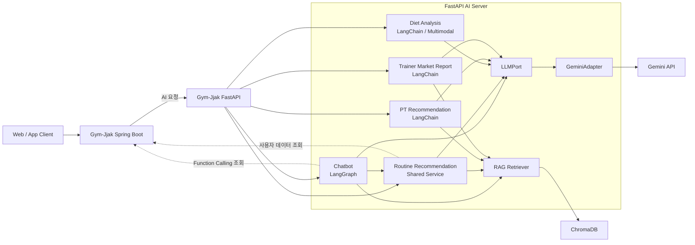
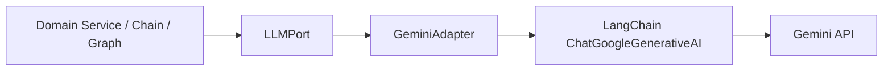
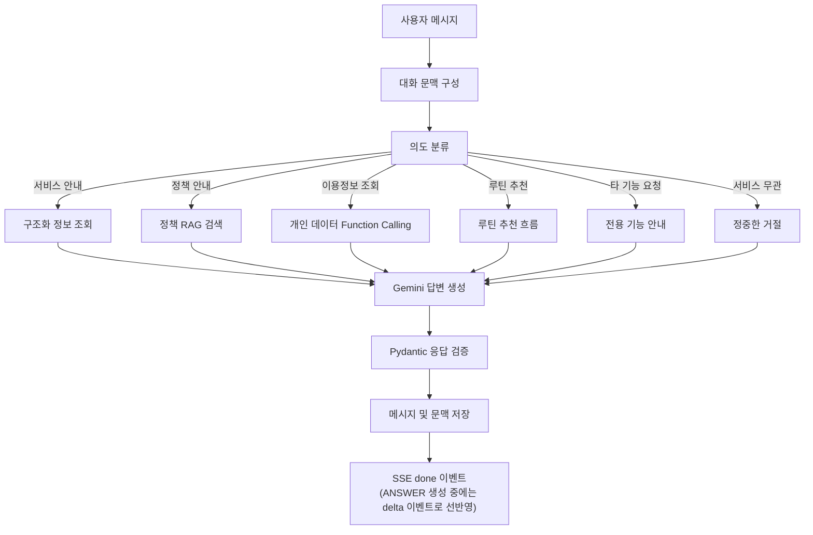
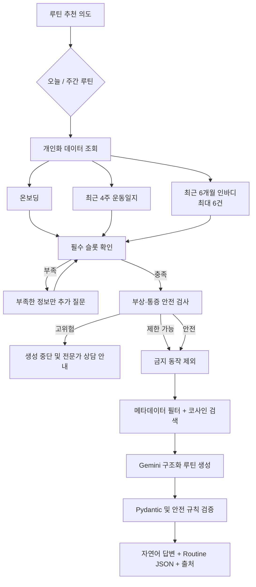
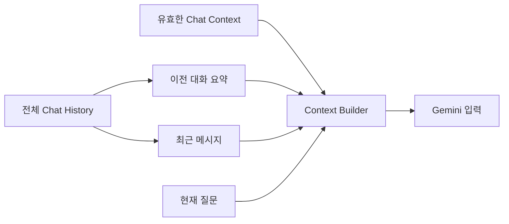
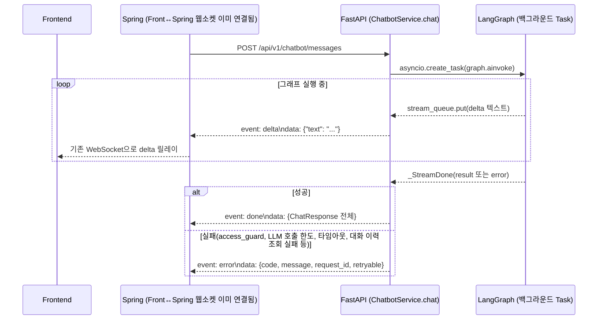

# 🏗️ Gym-Jjak AI Server Architecture

- 작성일: 2026-07-19
- 최종 수정일: 2026-07-23
- 상태: Task 1~14 구현 완료(회원 챗봇 + 트레이너 루틴 분석) + 챗봇 응답 SSE 스트리밍 전환 완료. Spring 연동은 별도 계획으로 진행 예정
- 문서 규칙: Markdown 파일명은 대문자로 작성하고, 주요 제목에는 의미에 맞는 이모지를 사용한다.

> 이 문서는 AI 서버의 전체 구조와 챗봇 아키텍처를 기록한다. 아키텍처를 변경할 때는 관련 내용과 `최종 수정일`을 함께 갱신한다.

## 🔧 실제 구현과의 차이 (2026-07-22 갱신)

아래는 최초 설계와 실제 구현이 달라진 부분과 이유다. 나머지 섹션은 설계 의도를 그대로 담고 있어 참고 자료로 유지한다.

| 항목 | 최초 설계 | 실제 구현 | 이유 |
| --- | --- | --- | --- |
| `app/chatbot/` 내부 구조 | `tools/`, `graph/{state,nodes,routes,builder}.py` 하위 폴더 | `tools.py`, `state.py`, `nodes.py`, `graph.py`, `prompts.py`, `service.py`, `router.py`, `dependencies.py`, `exceptions.py`, `schemas.py` 평면 구조 | 각 파일이 200줄 내외로 충분히 작아 폴더 분리가 과했음(YAGNI) |
| `app/core/dependencies.py`에 챗봇 조립 | 계획에 포함 | **`app/chatbot/dependencies.py` 신설**, `core/dependencies.py`는 무수정 | diet 합류 이후 공용 모듈 소유권 재정리(`.docs/MODULE_OWNERSHIP.md`) 결정을 따름 — core는 어떤 도메인도 import하지 않는다 |
| Function Calling 도구 이름 | `get_remaining_pt_count`, `get_onboarding_profile`, `get_inbody_summary` | `get_pt_usage`, `get_onboarding`, `get_recent_inbody` | `app/common/user_data_client.py`(Task 4)의 `UserDataClient` Port 메서드명과 통일 |
| 응답 형식 | `{answer, intent, personalization_level, routine:{summary,days}, sources:[{title,url,section}]}` | `{request_id, session_id, answer, category, routine: RoutineResult\|null, sources:[{source,title,category}], limited: bool}` | Spring과의 실제 계약 협의 결과(요청/응답 예시는 계획서 Task 12 참고). `personalization_level` 대신 `limited`(bool) 하나로 단순화, `RoutineResult`는 Task 7~8에서 확정된 구조화 스키마를 그대로 사용 |
| `chat_session`/`chat_message`/`chat_context` DB 테이블 | Spring RDS에 저장 | **미구현** — `InMemoryConversationProvider`(프로세스 메모리, 재시작 시 소멸)만 존재 | 승인된 Spring 챗봇 설계에 맞춰 영속화는 Spring이 소유하고, Spring이 요청마다 검증된 대화 이력·요약·문맥을 FastAPI로 전달하는 계약을 후속 구현한다. 현재 FastAPI는 Spring 영속 저장소를 조회하거나 이 요청 이력 계약을 사용하지 않는다. `ConversationProvider` Protocol과 InMemory 구현은 교체 경계를 위한 현 상태일 뿐이다. |
| 개인 데이터 조회 | Spring 조회 API 연동 | **미구현** — `InMemoryUserDataClient`가 항상 빈 값 반환(구독 비활성 등) | 동일하게 Deferred Integration Plan 범위. 현재 서버로 실제 채팅을 하면 항상 `CHATBOT_SUBSCRIPTION_REQUIRED`(403)가 반환됨 — 의도된 동작 |
| SSE Streaming | 후속 검토 | **구현 완료(2026-07-22)** — `POST /api/v1/chatbot/messages`가 `text/event-stream`으로 응답. 기존 non-streaming 응답은 제거하고 같은 경로를 교체 | Spring→FastAPI의 POST 요청 하나를 응답 종료까지 유지하고, FastAPI가 그 **동일 응답**에서 반복 `delta` SSE 이벤트를 전송한다. Spring은 이를 프론트와의 기존 WebSocket으로 릴레이한다. delta마다 HTTP 요청을 새로 만들지 않으며 AI 서버 ↔ Spring 사이에 별도 WebSocket도 열지 않는다. 자세한 설계와 흐름은 아래 "📡 SSE 스트리밍 응답" 절 참고 |

# 🌐 전체 아키텍처 흐름

Gym-Jjak AI 서버는 하나의 FastAPI 애플리케이션 안에서 챗봇, 식단 분석, PT 추천, 트레이너 시장동향 리포트를 Router 단위로 분리한다. 각 기능은 독립된 도메인 폴더와 프롬프트, 응답 스키마를 소유하며 공통 LLM 호출 계층과 RAG 인프라만 공유한다.



## 🔒 시스템 경계

- 클라이언트 요청의 기본 진입점과 사용자 인증은 Spring Boot가 담당한다.
- FastAPI는 AI 추론, RAG 검색, Function Calling 오케스트레이션을 담당한다.
- FastAPI는 RDS에 직접 접근하지 않는다.
- 개인 데이터는 Spring Boot 조회 API를 통해서만 가져온다.
- Spring Boot 코드는 FastAPI 초기 구현 단계에서 수정하지 않는다.
- 초기 FastAPI 구현은 Fake 또는 Mock 사용자 데이터로 완성한 뒤 마지막 연동 단계에서 Spring Boot API와 연결한다.
- Java와 FastAPI 사이의 인증·조회 API 계약은 `.docs/SPRING_INTEGRATION.md`에 정리한다(FastAPI→Spring 조회 8개 엔드포인트, `X-Internal-Api-Key` 공유 시크릿, 에러·재시도 매핑). 현재는 설계 제안 단계이며 Spring 팀 확정과 FastAPI 측 구현은 후속 작업이다.
- Spring이 소유할 챗봇 영속화, 요청 이력 전달, WebSocket 릴레이의 승인 문서는 별도 Spring 저장소의 `Gym-Jjak/src/main/java/com/ssambbong/gymjjak/chatbot/docs/{ARCHITECTURE,WEBSOCKET_API,WEBSOCKET_FLOW,API}.md`에 있다. 이 문서의 Spring 영속화·이력 전달 내용은 해당 계약을 반영하기 위한 **후속 구현 항목**이며, 아직 FastAPI 코드에 구현되지 않았다.

## 👥 사용자별 제공 범위

### USER

- `role=USER`이면서 유효한 구독권이 있는 회원만 새 챗봇 대화와 루틴 추천을 사용할 수 있다.
- 구독이 만료된 회원은 기존 채팅방과 메시지를 읽을 수 있지만 새 메시지를 전송할 수 없다.
- 개인 데이터 조회와 루틴 추천의 대상은 항상 인증된 본인으로 제한한다.

### TRAINER

- `role=TRAINER`는 구독 없이 트레이너용 루틴 분석 기능을 사용할 수 있다.
- 담당 PT 회원 관리 페이지에서 일회성 루틴 분석 버튼으로 실행한다.
- 트레이너용 분석은 채팅 세션을 생성하지 않는다.
- Spring Boot가 트레이너와 대상 회원 사이의 유효한 PT 관계를 확인해야 한다.
- 트레이너는 대상 회원의 온보딩, 최근 운동일지, 인바디, 루틴 작성에 필요한 PT 계약 정보만 사용할 수 있다.
- 결제 내역과 구독 상태처럼 루틴 작성에 필요하지 않은 회원 정보는 트레이너에게 제공하지 않는다.

## 🤖 AI 기능별 처리 방식

| 기능 | 실행 방식 | 대화 상태 | 주요 기술 |
| --- | --- | --- | --- |
| 회원 챗봇 | 다회성 대화 | 필요 | LangGraph, LangChain, Gemini, Function Calling, RAG |
| 트레이너 루틴 분석 | 일회성 분석 | 불필요 | 공통 Routine Service, RAG, Gemini |
| 식단 분석 | 일회성 이미지 분석 | 불필요 | LangChain, Gemini Multimodal |
| PT 추천 | 일회성 추천 | 불필요 | LangChain, RAG, Gemini |
| 시장동향 리포트 | 일회성 또는 스케줄 실행 | 불필요 | LangChain, RAG, Gemini |

## 🔌 LLM 호출 원칙



- `LLMPort`는 애플리케이션의 공통 LLM 호출 인터페이스다.
- `GeminiAdapter`는 Gemini와 LangChain 호출 세부사항을 격리한다.
- 공통 `generate()`는 모델을 한 번 호출하고 공통 응답으로 변환하는 역할까지만 담당한다.
- Function Calling 반복, RAG 검색, 안전 검사, Prompt 구성은 각 도메인이 담당한다.
- 모든 LangChain 코드를 `gemini_adapter.py` 한 파일에 모으지 않는다.
- LangChain과 LangGraph는 각 도메인의 AI 실행 계층에서만 사용한다.
- Router와 일반 요청·응답 Schema에는 LangChain 타입을 노출하지 않는다.
- 도메인별 Prompt, Tool, 출력 Schema는 해당 도메인 폴더가 소유한다.

# 🗂️ 전체 아키텍처 구조

```text
Gym-Jjak-fastapi/
├── .docs/
│   └── ARCHITECTURE.md
├── data/
│   ├── structured/                 # 연락처, 링크 등 정확성이 필요한 YAML/JSON
│   ├── documents/                  # 임베딩할 Markdown/PDF 원본
│   └── indexes/                    # 생성된 로컬 벡터 인덱스
├── app/
│   ├── core/
│   │   ├── settings.py
│   │   ├── dependencies.py
│   │   └── exceptions.py
│   ├── llm/
│   │   ├── port.py                 # LLMPort
│   │   ├── models.py               # 공통 요청·응답 모델
│   │   ├── errors.py               # 공통 LLM 오류
│   │   └── gemini_adapter.py       # Gemini 구현체
│   ├── chatbot/
│   │   ├── router.py
│   │   ├── schemas.py
│   │   ├── service.py
│   │   ├── prompts.py
│   │   ├── tools/
│   │   └── graph/
│   │       ├── state.py
│   │       ├── nodes.py
│   │       ├── routes.py
│   │       └── builder.py
│   ├── routine/
│   │   ├── router.py               # 트레이너 일회성 루틴 분석 API
│   │   ├── schemas.py
│   │   ├── service.py              # 회원·트레이너 공통 루틴 서비스
│   │   ├── prompts.py
│   │   ├── safety.py
│   │   └── analyzer.py
│   ├── rag/
│   │   ├── ingest.py
│   │   ├── retriever.py
│   │   ├── vector_store.py
│   │   └── schemas.py
│   ├── common/
│   │   └── user_data_client.py     # 추후 Spring Boot 조회 API 연결
│   ├── diet/                       # 다른 담당자 소유
│   ├── pt_recommendation/          # 다른 담당자 소유
│   └── trainer_report/             # 다른 담당자 소유
├── main.py
└── requirements.txt
```

## 🧩 모듈별 책임

### `app/core`

- 환경설정과 FastAPI 의존성 조립을 담당한다.
- 특정 도메인의 Prompt나 비즈니스 규칙을 포함하지 않는다.

### `app/llm`

- Gemini 모델의 초기화와 단일 호출을 담당한다.
- Gemini 응답을 애플리케이션 공통 응답으로 변환한다.
- 모델 호출 오류, 토큰 사용량, 응답 시간을 공통 형식으로 다룬다.
- 도메인별 Tool 실행이나 Prompt 선택을 담당하지 않는다.

### `app/chatbot`

- 회원의 다회성 대화를 관리한다.
- 의도 분류, 추가 질문, Function Calling 반복, 응답 조립을 담당한다.
- 서비스·정책 안내, 개인 이용정보 조회, 루틴 추천, 다른 기능 안내, 범위 밖 질문 거절을 처리한다.

### `app/routine`

- 회원 챗봇과 트레이너 분석에서 공통으로 사용하는 루틴 생성 기능을 제공한다.
- 온보딩, 최근 4주 운동일지, 최근 6개월 인바디를 분석한다.
- 안전 조건을 먼저 확인하고 RAG 근거와 사용자 데이터를 조합한다.
- 회원용 응답과 트레이너용 상세 분석 응답을 서로 다른 Schema로 반환한다.

### `app/rag`

- `data/documents`의 문서를 청크로 나누고 임베딩한다.
- `data/structured`의 정확한 서비스 정보를 별도로 조회한다.
- 카테고리와 키워드 메타데이터 필터, 코사인 유사도 검색을 제공한다.
- 검색 결과에 문서 제목, 링크, 섹션을 포함해 출처를 남긴다.

## 📚 RAG 및 벡터 저장소

### 문서 갱신

- 관리자가 `data/`에 문서를 추가하거나 수정한다.
- 별도 적재 명령을 수동 실행한다.
- 문서 해시를 비교해 신규 또는 변경 문서만 다시 적재한다.
- FastAPI 시작 시 전체 문서를 자동 재적재하지 않는다.

### 임베딩

- Gemini Embedding API를 사용한다.
- 초기 모델은 `gemini-embedding-001`을 사용한다.
- 출력 차원은 768로 고정한다.
- 문서 적재는 `RETRIEVAL_DOCUMENT`, 질문 검색은 `RETRIEVAL_QUERY` 용도로 구분한다.
- 유사도 계산은 cosine 방식을 사용한다.
- 임베딩 모델이나 출력 차원을 변경하면 기존 컬렉션을 재사용하지 않고 전체 문서를 다시 적재한다.

### ChromaDB 실행 방식

```text
개발 환경
FastAPI → Chroma PersistentClient → 로컬 디스크

배포 환경
FastAPI → Chroma HttpClient → 별도 Chroma 서버
```

- 개발 환경은 실습 코드와 동일한 로컬 Persistent 방식으로 시작한다.
- 배포 환경은 서버 기반 Chroma 연결로 전환한다.
- 연결 방식은 `vector_store.py`와 환경설정으로 격리한다.

# 💬 챗봇 아키텍처 구조

## 🎯 챗봇 담당 역할

- 서비스 안내: 회사와 서비스 이용에 관한 기본 질문
- 정책 안내: 환불 정책, 고객센터 연락처 등
- 이용정보 조회: 결제 내역, 잔여 PT 횟수, PT 이력, 구독 상태
- 루틴 추천: 개인 운동기록과 온보딩, 인바디를 기반으로 대화 안에서 직접 생성
- 타 기능 안내: 식단 분석과 PT 추천 요청은 해당 기능으로 안내만 수행

## 🔄 요청 처리 흐름



> `ANSWER` 단계(개인 이용정보/정책 RAG의 실제 Gemini 텍스트 생성, 루틴/거절의 완성된 답변)는 아래 "📡 SSE 스트리밍 응답" 절에서 설명하는 대로 `delta` 이벤트로 먼저 흘러나가고, 그래프 실행이 끝나면 `SAVE` 이후 `done`(또는 실패 시 `error`) 이벤트로 마무리된다. 그래프의 노드 구성과 조건부 분기 자체는 스트리밍 도입 전과 동일하다.

## 🏋️ 루틴 추천 흐름

루틴 추천 버튼은 요청에 `intent_hint=ROUTINE_RECOMMENDATION`을 포함한다. 사용자가 자연어로 루틴 추천을 요청한 경우에도 의도 분류를 거쳐 동일한 흐름으로 진입한다.



## 📊 루틴 생성 우선순위

```text
안전 규칙
→ 인증·권한 컨텍스트
→ 최근 4주 운동일지
→ 최근 6개월 인바디
→ 온보딩 정보
→ 현재 대화에서 확인한 조건
→ RAG로 검색한 검증 자료
→ Gemini의 일반 운동 지식
```

- Gemini의 일반 지식이 안전 규칙이나 RAG 근거와 충돌하면 우선하지 않는다.
- 운동 기록이 부족하면 오래된 운동일지를 무리하게 확장하지 않는다.
- 부족한 정보는 온보딩, 현재 대화, RAG 자료로 보완하고 개인화 한계를 응답에 표시한다.
- 최근 기록이 충분한 운동만 참고 중량을 제공한다.
- 기록이 부족하거나 새로운 운동은 RPE 또는 RIR 기준으로 안내한다.
- 생성된 루틴은 1차 버전에서 대화 응답으로만 제공하고 서버에 저장하지 않는다.

## 🛠️ Function Calling 원칙

- Function Calling 도구는 Spring Boot 조회 API를 호출한다.
- FastAPI는 RDS 테이블을 직접 조회하지 않는다.
- 모든 도구는 읽기 전용이다.
- `user_id`와 `subject_user_id`는 Gemini가 선택하는 Tool 인자로 노출하지 않는다.
- 인증된 서버 컨텍스트에서 대상 사용자를 고정한다.
- 일부 개인화 데이터 조회에 실패하면 확보된 데이터로 제한적으로 생성하고 한계를 표시한다.
- 안전 필수 정보가 없으면 루틴을 바로 생성하지 않고 사용자에게 확인한다.

개인 회원용 조회 도구의 논리적 범위는 다음과 같다.

```text
get_payment_history
get_pt_usage
get_pt_history
get_subscription_status
get_onboarding
get_recent_workouts
get_recent_inbody
```

## 🧠 대화 기억

현재 FastAPI는 `InMemoryConversationProvider`에 대화 기억을 보관하므로 프로세스 재시작 시 사라진다. Spring 영속화 전환 후에는 Spring이 전체 이력을 보관하고, FastAPI에는 필요한 문맥만 요청 body `memory`로 전달한다. Gemini에는 모든 메시지를 전달하지 않는다.



Gemini 입력 문맥은 다음으로 구성한다.

```text
시스템 Prompt
+ 이전 대화 요약
+ 최근 메시지
+ 만료되지 않은 중요 Context
+ 현재 사용자 메시지
+ 필요한 Tool 실행 결과
```

## 🗄️ 채팅 데이터 구조 (후속 Spring 구현 계약)

### `chatbot_session`

- 채팅방 소유 사용자
- 외부용 Session Key
- 제목과 상태
- 진행 중 요청 식별자와 만료 시각
- 생성일, 수정일, 마지막 활동일

### `chatbot_message`

- Chat Session ID
- Role: `USER` 또는 `ASSISTANT`
- 자연어 Content
- USER `intent_hint` 또는 ASSISTANT `category`
- 구조화된 Routine JSON
- Sources JSON, limited 여부
- 메시지 순서
- 생성일

요약·중요 Context는 현재 FastAPI 메모리 경계에만 존재한다. Spring 영속 모델에 별도 필드를 추가하기 전까지 요청 `memory`에서는 각각 `null`, 빈 배열로 전달한다.

## ⏳ 대화 보관 및 유효기간

- 후속 Spring 구현에서 비활성 `chatbot_session`과 종속 `chatbot_message`는 마지막 활동일로부터 6개월 뒤 정리한다.
- 직접 세션 삭제, Context TTL, 회원 탈퇴 시 처리 방식은 아직 구현·확정되지 않았으며 Spring 회원 데이터 정책과 함께 결정한다.

## 📡 SSE 스트리밍 응답

`POST /api/v1/chatbot/messages`는 `200 text/event-stream`으로 응답한다. 인증 실패(401)와 요청 검증 실패(422)는 스트림을 열기 전에 발생하므로 기존과 동일하게 일반 JSON 오류 응답이다. 요청이 라우터 핸들러에 도달한 뒤에는 항상 200으로 스트림을 열고, 이후 실패는 전부 `error` 이벤트로 전달한다(§ `.docs/ERROR_HANDLING.md`의 "챗봇 스트리밍 엔드포인트 예외" 참고).

Spring은 FastAPI로 **POST 요청 하나만** 보내고 그 연결을 열어 둔다. FastAPI는 그 한 HTTP 응답에서 `delta` 이벤트를 여러 번 전송하며, Spring은 각 delta를 기존 WebSocket 연결로 프론트에 릴레이한다. 따라서 토큰 또는 delta마다 Spring→FastAPI HTTP 요청을 반복하지 않는다. Spring 측 공개 계약과 릴레이 흐름은 별도 Spring 저장소의 `Gym-Jjak/src/main/java/com/ssambbong/gymjjak/chatbot/docs/{WEBSOCKET_API,WEBSOCKET_FLOW}.md`에서 확인한다.



- `agent_node`(개인 이용정보)와 `rag_node`(정책 RAG)는 Gemini 텍스트를 `LLMPort.stream()`으로 호출해 받은 청크를 그대로 큐에 흘려보낸다.
- `routine_node`(루틴 추천), `reject_node`(정중한 거절), `greeting_node`(인사 응답)는 Gemini 구조화 출력 또는 고정 문구라 토큰 스트리밍이 불가능하므로, 완성된 답변을 통째로 큐에 한 번 넣는다.
- **어절 단위 재분할(2026-07-25):** 노드가 큐에 넣는 조각의 크기는 라우트마다 제각각이므로, `ChatbotService.chat()`이 큐에서 꺼낸 텍스트를 누적 버퍼에 모았다가 **어절(공백) 단위로 쪼개** delta로 내보낸다(`_split_ready_words`). Gemini 청크가 어절 중간에서 끊겨도(예: `"운동"` + `"을 하고"`) 버퍼가 이어 붙여 주므로 항상 올바른 어절 경계에서만 delta가 나간다. 프론트엔드가 타이핑 효과를 적용하기 쉽도록 한 요청에 따른 변경이며, 모든 라우트가 "delta 최소 1개 이상 → done" 순서를 지키는 점은 동일하다. 정상 스트리밍 경로에서는 전송된 delta들의 `text`를 순서대로 이어붙이면 `done.answer`와 정확히 같다.
- 다만 이 일치는 절대적이지 않다. LLM이 빈 텍스트를 반환하면(안전 차단, MAX_TOKENS 등) `nodes.py`의 `if chunk.delta:` 가드에 걸려 큐에 아무것도 들어가지 않아 **delta가 0개**인 채로 `answer`에는 대체 문구(`_FALLBACK_ANSWER`)가 채워질 수 있고, Function Calling 중간 턴이 남긴 텍스트는 최종 `answer`에 포함되지 않을 수도 있다. `done` 이벤트의 `answer` 필드는 항상 **완성된 전체 텍스트**다. Spring은 이미 흘려보낸 delta들 뒤에 `done.answer`를 다시 이어붙이면 안 되지만(중복 표시 방지), **delta가 한 건도 오지 않은 채 done만 온 경우에는 빈 말풍선을 보여주지 않도록 반드시 `done.answer`를 표시해야 한다** — `done.answer`는 그 외에는 저장/로그용 최종 텍스트로만 사용한다.
- 에러 통일 원칙: access_guard 실패(구독 만료 등), `LLM_CALL_LIMIT_EXCEEDED`, 요청 타임아웃, 대화 이력(`conversation_provider`) 조회 실패를 포함한 **모든 실패 경로**가 예외를 던지는 대신 `error` 이벤트로 변환된다. 스트림이 이미 200으로 열린 뒤에는 HTTP status를 바꿀 수 없기 때문이며, 사용자가 명시적으로 선택한 단순화다.
- 구현은 `ChatbotService.chat()` 안에서 그래프 실행(`graph.ainvoke`)을 백그라운드 `asyncio.Task`로 돌리고, `asyncio.Queue` + 종료 신호(`_StreamDone` sentinel)로 델타 이벤트와 종료 이벤트를 구분한다. 클라이언트(Spring) 연결이 끊기면 `finally`에서 백그라운드 task를 취소해 불필요한 LLM 호출을 막는다.
- LangGraph의 노드 구성(`access_guard → intent_router → agent_node/rag_node/routine_node/reject_node → format_node → persist_node`)과 조건부 라우팅은 스트리밍 도입 전과 완전히 동일하다 — 각 노드가 LLM을 호출하는 지점만 스트리밍 방식으로 바뀌었다.

## 📦 완성 응답(`done` 이벤트) 형식

`done` 이벤트의 `data`는 다음 구조다(실제 필드는 `app/chatbot/schemas.py::ChatResponse`가 최신 기준).

```json
{
  "request_id": "019f0000-0000-7000-8000-000000000002",
  "session_id": "019f0000-0000-7000-8000-000000000001",
  "answer": "사용자에게 표시할 완성된 답변",
  "category": "ROUTINE",
  "routine": {
    "summary": "루틴 구성 설명",
    "days": []
  },
  "sources": [
    {
      "source": "data/documents/policy/refund.md",
      "title": "참고 문서 제목",
      "category": "policy"
    }
  ],
  "limited": false
}
```

- 답변의 표현 양식은 Prompt로 통제한다.
- JSON 구조는 Prompt에만 의존하지 않고 Gemini 구조화 출력과 Pydantic으로 검증한다.
- RAG를 사용한 정책·서비스·루틴 답변에는 참고 문서 출처를 포함한다.

## 📝 문서 변경 이력

| 날짜 | 변경 내용 |
| --- | --- |
| 2026-07-19 | 전체 AI 서버 및 챗봇 초기 아키텍처 작성 |
| 2026-07-22 | Task 1~14 구현 완료에 맞춰 "실제 구현과의 차이" 섹션 추가 (모듈 구조, DI 위치, 도구 이름, 응답 형식, 미구현 범위) |
| 2026-07-22 | 챗봇 응답 SSE 스트리밍 전환 반영: "SSE Streaming" 행 구현 완료로 갱신, "📡 SSE 스트리밍 응답" 절 신규 추가, "🔄 요청 처리 흐름" 최종 노드를 SSE 이벤트로 갱신, 기존 "📦 응답 형식"을 `done` 이벤트 payload 설명으로 재정리 |
| 2026-07-22 | "🔒 시스템 경계"의 "Java·FastAPI 인증 방식 보류" 문장을 신규 계약 문서 `.docs/SPRING_INTEGRATION.md` 참조로 갱신(FastAPI→Spring 조회 API 계약) |
| 2026-07-23 | 승인된 Spring 챗봇 문서 경로를 교차 참조하고, Spring 소유 영속화·요청 이력 전달 계약은 후속 구현임을 명시. 단일 Spring→FastAPI POST의 동일 SSE 응답에서 반복 delta를 전송하고 Spring이 기존 WebSocket으로 릴레이하는 흐름(Delta별 HTTP 재요청 없음)을 명확화 |
| 2026-07-25 | 프론트 요청(delta가 너무 큼)에 따라 `ChatbotService.chat()`이 delta를 어절 단위로 재분할하도록 변경. "📡 SSE 스트리밍 응답" 절의 노드별 delta 설명을 갱신 |
