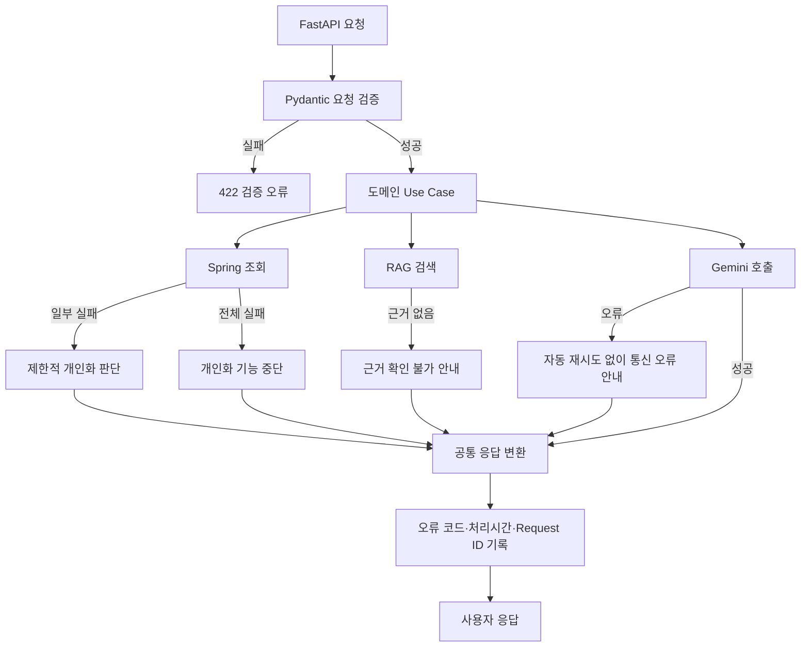
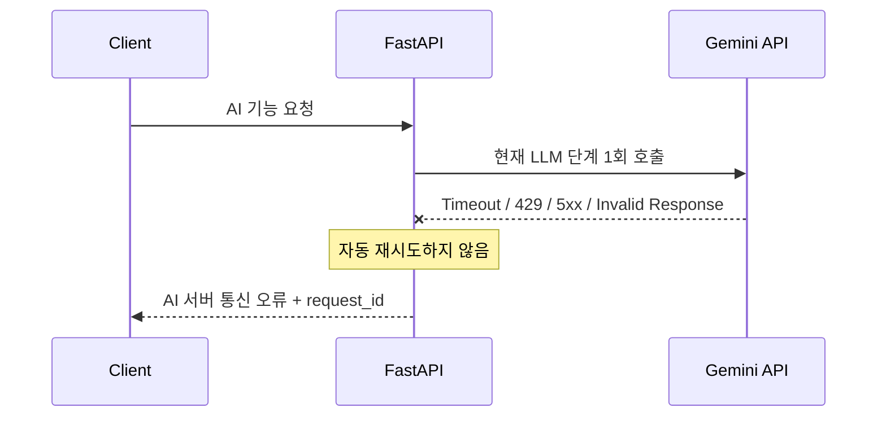

# ⚠️ Gym-Jjak AI Server Error Handling

- 작성일: 2026-07-19
- 최종 수정일: 2026-07-22
- 상태: 오류 처리 정책 확정, 챗봇/루틴 도메인 구현 완료
- 문서 규칙: Markdown 파일명은 대문자로 작성하고, 주요 제목에는 의미에 맞는 이모지를 사용한다.

> 이 문서는 Gym-Jjak AI 서버의 오류 분류, 사용자 안내, 재시도, Timeout, 로그 정책을 정의한다. 정책을 변경할 때는 관련 내용과 `최종 수정일`을 함께 갱신한다.

## 🔧 실제 구현과의 차이 (2026-07-22 갱신)

아래 "🧭 오류 분류" 표의 코드는 최초 설계안이며, 실제로는 `AppError` 하위 클래스로 다음 코드를 구현했다(공통 응답 형식 `{code, message, request_id, retryable}`은 설계와 동일).

| 실제 오류 코드 | 상황 | HTTP | 위치 |
| --- | --- | --- | --- |
| `INTERNAL_AUTH_FAILED` | X-Internal-Api-Key 누락/불일치 | 401 | `app/core/exceptions.py`, `app/common/auth.py` |
| `REQUEST_VALIDATION_ERROR` | Pydantic 요청 검증 실패 | 422 | `app/core/error_handlers.py` |
| `ROLE_NOT_ALLOWED` | role이 기대한 값(USER/TRAINER)이 아님 | 403 | `app/routine/exceptions.py` (챗봇도 재사용) |
| `CHATBOT_SUBSCRIPTION_REQUIRED` | 활성 구독 없이 챗봇/루틴 요청 | 403 | `app/routine/exceptions.py` |
| `TRAINER_SUBJECT_ACCESS_DENIED` | 트레이너-회원 담당 관계 없음 | 403 | `app/common/exceptions.py` |
| `LLM_NETWORK_ERROR` | Gemini 연결/Timeout | 503 | `app/llm/errors.py` |
| `LLM_RATE_LIMITED` | Gemini 429 | 503 | `app/llm/errors.py` |
| `LLM_INVALID_RESPONSE` | 구조화 출력 검증 실패 | 502 | `app/llm/errors.py` |
| `LLM_CALL_LIMIT_EXCEEDED` | 요청당 LLM 호출 6회 초과 | 503 | `app/chatbot/exceptions.py` |
| `CHATBOT_REQUEST_TIMEOUT` | 요청 처리 60초 초과 | 504 | `app/chatbot/exceptions.py` |
| `INTERNAL_SERVER_ERROR` | 분류되지 않은 예외 | 500 | `app/core/error_handlers.py` |

설계안의 `ACCESS_DENIED`, `SPRING_CLIENT_ERROR`, `SPRING_UNAVAILABLE`, `PERSONAL_DATA_PARTIAL/UNAVAILABLE`, `RAG_RESULT_NOT_FOUND`, `RAG_UNAVAILABLE`, `ROUTINE_SAFETY_INFO_REQUIRED`는 **아직 구현되지 않았다** — Spring 연동(Deferred Integration Plan)이 붙기 전까지는 `InMemoryUserDataClient`가 항상 빈 값을 반환하므로 "일부 실패"라는 상태 자체가 발생하지 않는다. `PERSONAL_DATA_PARTIAL`은 `RoutineResult.status="LIMITED"` + `missing_data` 필드로, `ROUTINE_SAFETY_INFO_REQUIRED`는 `RoutineResult.status="BLOCKED"` + `cautions` 필드로 각각 200 응답 안에서 표현하는 방식으로 대체 구현했다.

### 🌊 챗봇 스트리밍 엔드포인트 예외 (2026-07-22 추가)

`POST /api/v1/chatbot/messages`가 SSE(`text/event-stream`)로 바뀌면서, 이 엔드포인트만 아래 표의 일반 원칙과 다르게 동작한다(다른 모든 엔드포인트는 기존 HTTP status 기반 오류 계약을 그대로 따른다).

| 구분 | 일반 엔드포인트 | 챗봇 스트리밍 엔드포인트 |
| --- | --- | --- |
| 인증 실패(`INTERNAL_AUTH_FAILED`), 요청 검증 실패(`REQUEST_VALIDATION_ERROR`) | HTTP status로 응답 | **동일** — 스트림을 열기 전에 발생하므로 그대로 HTTP status |
| `ROLE_NOT_ALLOWED`, `CHATBOT_SUBSCRIPTION_REQUIRED`, `LLM_CALL_LIMIT_EXCEEDED`, `CHATBOT_REQUEST_TIMEOUT`, `LLM_NETWORK_ERROR` 등 | HTTP status(403/503/504 등) + JSON body | **SSE `event: error`** — 스트림이 이미 200으로 열린 뒤라 HTTP status를 바꿀 수 없음. body 필드(`code`/`message`/`request_id`/`retryable`)는 동일하게 유지 |
| 대화 이력(`conversation_provider`) 조회 실패 등 미분류 예외 | 500 `INTERNAL_SERVER_ERROR` | `error` 이벤트로 `INTERNAL_ERROR` (서버 로그에는 `logger.exception`으로 스택트레이스 기록) |

- `{code, message, request_id, retryable}` 공통 응답 필드 계약은 그대로 유지된다 — 전달 방식(HTTP status vs. SSE 이벤트)만 다르다.
- Spring은 이 엔드포인트에 한해 HTTP status가 아니라 이벤트 body의 `code` 필드로 오류 종류를 분기해야 한다.
- 이 예외는 Spring이 프론트와 이미 열어둔 웹소켓으로 델타를 릴레이하기 위한 설계 단순화이며, 자세한 배경은 `docs/superpowers/specs/2026-07-22-chatbot-streaming-design.md`를 참고한다.

# 🎯 오류 처리 목표

- 외부 서비스 장애가 전체 FastAPI 프로세스 장애로 확산되지 않게 한다.
- 사용자가 이해할 수 있는 일관된 오류 메시지를 반환한다.
- Gemini 호출은 비용이 발생하는 부가 기능이므로 실패한 LLM 단계를 자동으로 재시도하지 않는다.
- 조회된 근거가 없거나 불완전하면 개인 데이터를 추측하지 않는다.
- API Key, Prompt, 개인 운동정보, 내부 예외를 사용자 응답과 일반 로그에 노출하지 않는다.
- 모든 오류는 `request_id`와 공통 오류 코드로 추적할 수 있게 한다.

# 🔄 전체 오류 처리 흐름



# 📦 공통 오류 응답

```json
{
  "code": "LLM_NETWORK_ERROR",
  "message": "AI 서버 통신 중 네트워크 오류가 발생했습니다. 잠시 후 다시 시도해 주세요.",
  "request_id": "019f0000-0000-0000-0000-000000000000",
  "retryable": true
}
```

## 공통 필드

| 필드 | 설명 |
| --- | --- |
| `code` | 서버 내부에서 구분하는 안정적인 오류 코드 |
| `message` | 사용자에게 표시할 안전한 메시지 |
| `request_id` | 로그 추적을 위한 요청 식별자 |
| `retryable` | 사용자가 직접 다시 요청할 수 있는 오류인지 여부 |

- `retryable=true`는 서버가 자동 재시도했다는 뜻이 아니다.
- 사용자가 화면에서 다시 시도할 수 있음을 의미한다.
- 사용자 응답에는 Stack Trace, 내부 URL, API Key, 원본 Prompt를 포함하지 않는다.

# 🧭 오류 분류

| 오류 코드 | 상황 | HTTP 상태 | 사용자 처리 |
| --- | --- | --- | --- |
| `REQUEST_VALIDATION_ERROR` | 요청 Schema 검증 실패 | 422 | 잘못된 입력 필드 안내 |
| `ACCESS_DENIED` | 기능 또는 대상 사용자 접근 권한 없음 | 403 | 접근 불가 안내 |
| `SPRING_CLIENT_ERROR` | Spring이 4xx 응답 반환 | 상황별 4xx | 요청 또는 권한 확인 안내 |
| `SPRING_UNAVAILABLE` | Spring 연결·Timeout·5xx 실패 | 503 | 이용정보 조회 실패 안내 |
| `PERSONAL_DATA_PARTIAL` | 개인화 데이터 일부만 조회 | 200 | 제한적 개인화임을 표시 |
| `PERSONAL_DATA_UNAVAILABLE` | 개인화 데이터 전체 조회 실패 | 503 | 개인 맞춤 기능 중단 |
| `RAG_RESULT_NOT_FOUND` | 관련 근거 문서를 찾지 못함 | 200 또는 404 | 확인 가능한 근거가 없음을 안내 |
| `RAG_UNAVAILABLE` | Chroma 연결 또는 검색 실패 | 503 | 근거 기반 답변 중단 |
| `LLM_NETWORK_ERROR` | Gemini 연결·Timeout·일시 장애 | 503 | 네트워크 오류 안내 |
| `LLM_RATE_LIMITED` | Gemini 요청 한도 초과 | 503 | 잠시 후 직접 다시 시도 안내 |
| `LLM_INVALID_RESPONSE` | Gemini 응답 구조 검증 실패 | 502 | 정상 응답 생성 실패 안내 |
| `TOOL_CALL_LIMIT_EXCEEDED` | Tool Call 최대 횟수 초과 | 502 | 요청 처리 실패 안내 |
| `ROUTINE_SAFETY_INFO_REQUIRED` | 안전 필수 정보 부족 | 200 | 오류 대신 추가 질문 반환 |

# 🚫 Gemini 무재시도 정책

Gemini API는 호출마다 비용과 사용량이 발생하므로 실패한 호출을 서버가 자동으로 재시도하지 않는다. Function Calling에서 도구 선택 결과를 실행한 뒤 그 결과를 Gemini에 전달하는 호출은 정상 워크플로우의 다음 단계이며 오류 재시도가 아니다.

```text
예정된 LLM 단계별 최대 호출 시도 횟수: 1회
실패한 LLM 단계의 자동 재시도 횟수: 0회
구조화 응답 재생성 횟수: 0회
한 사용자 요청의 전체 LLM 호출 상한: 6회
```

다음 오류가 발생해도 서버는 Gemini를 다시 호출하지 않는다.

- 연결 실패
- 응답 Timeout
- HTTP 429 요청 한도 초과
- Gemini 5xx 일시 장애
- 구조화 출력 Pydantic 검증 실패
- 안전 필터에 의한 응답 차단

## Gemini 오류 처리 흐름



## 사용자 안내

Gemini의 세부 장애 유형은 서버 로그와 오류 코드로 구분하되 사용자에게는 다음과 같이 단순하게 안내한다.

```text
AI 서버 통신 중 네트워크 오류가 발생했습니다.
잠시 후 다시 시도해 주세요.
```

- Gemini 실패 결과를 정상 Assistant 메시지로 저장하지 않는다.
- 사용자 메시지는 채팅 기록에 유지할 수 있다.
- 실패 상태는 별도 오류 로그 또는 메시지 상태로 추적할 수 있다.
- 사용자가 다시 시도할 때만 새로운 Gemini API 호출을 수행한다.

# 🔁 외부 조회 재시도 정책

Gemini 외의 읽기 전용 내부 조회는 사용자 데이터 정합성과 서비스 비용을 고려해 제한적으로 처리한다.

| 대상 | 자동 재시도 | 조건 |
| --- | --- | --- |
| Gemini API | 실패한 단계 0회 | 정상 Function Calling 후속 호출은 허용하되 실패한 호출은 재시도하지 않음 |
| 구조화 응답 재생성 | 0회 | Pydantic 실패 시 즉시 오류 처리 |
| Spring 읽기 API | 최대 1회 | 연결 오류, Timeout, 모든 5xx(500/502/503/504) |
| Spring 4xx | 0회 | 잘못된 요청과 권한 오류는 재시도하지 않음 |
| Chroma 검색 | 0회 | 오류를 즉시 RAG 오류로 변환 |
| 동일 Tool 반복 요청 | 0회 | 같은 Tool과 인자 반복 시 중단 |

Spring 재시도는 조회 전용 요청에만 적용한다. 데이터 생성·수정·삭제 요청에는 적용하지 않는다.

# 🛠️ Function Calling 제한

- 한 사용자 요청에서 Tool Call은 최대 5회로 제한한다.
- 한 사용자 요청에서 정상 워크플로우를 포함한 전체 Gemini 호출은 최대 6회로 제한한다.
- 같은 이름과 같은 인자의 Tool을 반복 요청하면 실행하지 않고 중단한다.
- 모든 Tool은 초기 버전에서 읽기 전용이다.
- `user_id`와 `subject_user_id`는 Gemini가 생성한 인자에서 받지 않는다.
- 인증된 서버 Context에 고정된 대상만 조회한다.
- Tool 실행 오류를 그대로 Gemini Prompt나 사용자 응답에 노출하지 않는다.
- Tool이 정상 실행되면 결과를 Gemini에 전달해 다음 응답을 생성할 수 있으며 이는 재시도가 아니다.
- Tool 오류가 발생하면 같은 Tool이나 실패한 LLM 단계를 자동 재시도하지 않는다.

# ⏱️ Timeout 정책

초기 Timeout은 다음 값으로 시작하고 운영 측정 결과에 따라 환경설정으로 조정한다.

| 대상 | 초기 Timeout |
| --- | --- |
| Spring 연결 | 2초 |
| Spring 응답 | 5초 |
| Chroma 검색 | 3초 |
| Gemini 응답 | 45초 |
| FastAPI 전체 요청 | 60초 |

- 모든 Timeout은 코드 상수가 아니라 환경설정으로 관리한다.
- FastAPI 전체 제한시간이 개별 외부 호출 시간보다 짧아지지 않게 검증한다.
- Timeout 발생 시 실행 중인 비동기 작업을 취소하고 연결 자원을 정리한다.
- Gemini Timeout 이후 서버가 자동으로 동일 요청을 다시 전송하지 않는다.

# 🧩 기능별 실패 처리

## 서비스·정책 안내

```text
구조화 서비스 정보 조회 실패
→ 전화번호와 링크를 추측하지 않음
→ 현재 정보를 확인할 수 없다고 안내

정책 RAG 검색 실패
→ 환불 조건을 일반 지식으로 생성하지 않음
→ 공식 고객센터 또는 정책 페이지 이용 안내
```

## 개인 이용정보 조회

```text
결제·PT·구독 조회 일부 실패
→ 조회된 항목만 제공
→ 실패한 항목을 명시
→ 조회하지 못한 값을 추측하지 않음

전체 조회 실패
→ 개인 이용정보 답변 중단
→ 네트워크 조회 오류 안내
```

## 루틴 추천

```text
온보딩·운동일지·인바디 일부 실패
→ 확보된 데이터로 제한적 개인화
→ personalization_level=LIMITED
→ 누락된 데이터와 한계를 사용자에게 표시

모든 개인화 데이터 실패
→ 개인 맞춤 루틴 생성 중단

부상·통증 정보 부족
→ 오류가 아닌 추가 질문으로 전환

RAG 실패
→ 근거 기반 루틴 생성 중단

Gemini 실패
→ 자동 재시도 없이 AI 서버 통신 오류 안내
```

## 트레이너 루틴 분석

- 담당 회원과의 PT 관계가 확인되지 않으면 분석을 시작하지 않는다.
- 회원 데이터가 전체 실패하면 분석과 루틴 추천을 중단한다.
- 일부 데이터만 조회되면 누락 항목과 분석 한계를 결과에 표시한다.
- Gemini 호출이 실패하면 자동 재시도하지 않고 일회성 분석 실패로 반환한다.
- 실패한 결과를 정상 분석 결과로 저장하지 않는다.

# 🪵 로그 및 개인정보 보호

## 기록할 정보

- `request_id`
- 요청 도메인
- 실행 단계 또는 LangGraph Node
- 외부 호출 대상
- 처리시간
- 오류 코드
- HTTP 상태
- Tool 이름과 호출 횟수
- Gemini 토큰 사용량이 반환된 경우 사용량

## 기록하지 않을 정보

- Gemini API Key
- 내부 인증 Key
- 전체 Prompt 원문
- 전체 사용자 대화 원문
- 개인 운동일지 원문
- 인바디 상세 원문
- 결제 내역
- JWT 원문
- `user_id`, `subject_user_id` 원문

운영 로그에서 사용자를 구분해야 한다면 원본 ID 대신 비가역적 마스킹 또는 내부 추적용 식별자를 사용한다.

# ✅ 오류 처리 완료 기준

- 모든 외부 오류가 공통 오류 코드로 변환된다.
- Gemini 오류 발생 시 해당 LLM 단계의 실제 호출 횟수가 정확히 1회다.
- Gemini 구조화 출력 실패 시 재생성 호출을 하지 않는다.
- 일부 개인화 데이터 실패 시 `LIMITED` 결과 또는 명시적 중단이 적용된다.
- RAG 근거가 없을 때 정책이나 운동 정보를 추측하지 않는다.
- 사용자 응답에 내부 예외와 민감정보가 노출되지 않는다.
- 실패한 Gemini 답변이 정상 Assistant 메시지로 저장되지 않는다.
- 로그만으로 `request_id`에 해당하는 실패 단계와 처리시간을 확인할 수 있다.

# 📝 문서 변경 이력

| 날짜 | 변경 내용 |
| --- | --- |
| 2026-07-19 | Gemini 무재시도 원칙을 포함한 초기 오류 처리 정책 작성 |
| 2026-07-22 | 실제 구현된 오류 코드 표 반영, 미구현 코드(Spring 연동 의존)와 대체 구현 방식 명시 |
| 2026-07-22 | 챗봇 스트리밍 엔드포인트 전환에 맞춰 "🌊 챗봇 스트리밍 엔드포인트 예외" 절 추가 — `POST /api/v1/chatbot/messages`만 모든 실패를 HTTP status 대신 SSE `error` 이벤트로 전달하는 예외를 명시 |
| 2026-07-22 | Spring 읽기 API 재시도 조건을 "502·503"에서 "모든 5xx(500/502/503/504)"로 정합 — Deferred Integration Plan의 "5xx/timeout 1회 재시도" 및 신규 계약 문서 `.docs/SPRING_INTEGRATION.md`와 일치(전 엔드포인트가 idempotent GET) |
