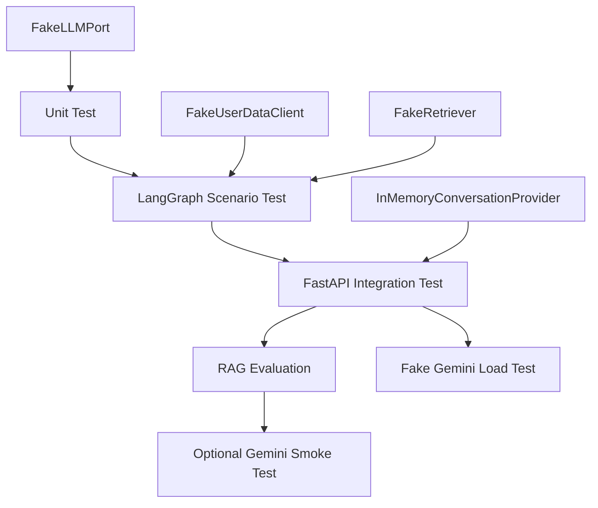
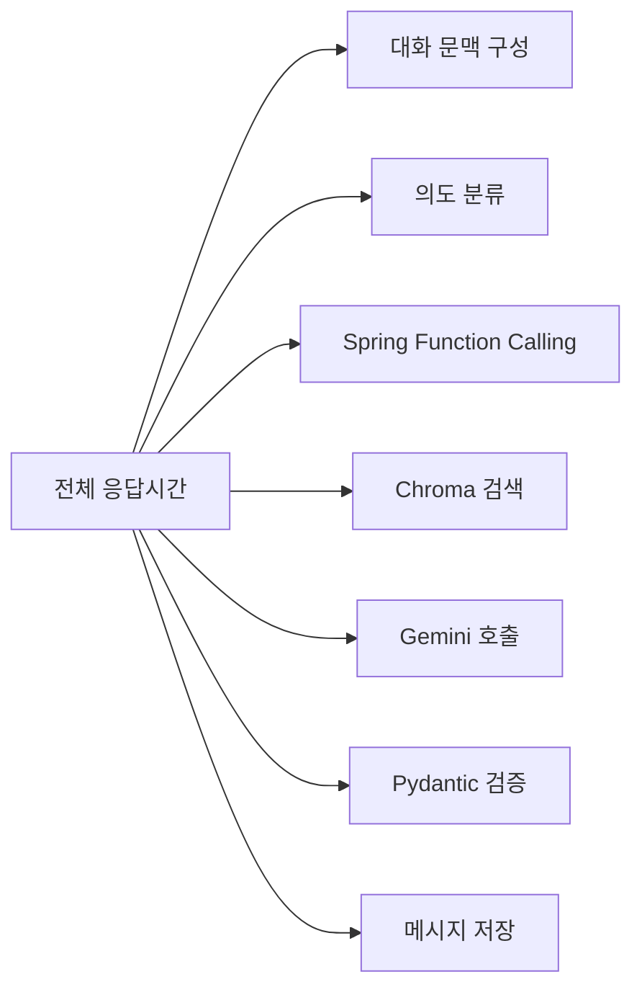

# 🧪 Gym-Jjak AI Server Testing and Performance

- 작성일: 2026-07-19
- 최종 수정일: 2026-07-22
- 상태: 테스트 및 성능 측정 정책 확정, Task 1~14 구현 완료
- 문서 규칙: Markdown 파일명은 대문자로 작성하고, 주요 제목에는 의미에 맞는 이모지를 사용한다.

> 이 문서는 Gym-Jjak AI 서버의 테스트 계층, AI 품질 평가, 성능 측정, 부하 테스트 정책을 정의한다. 정책을 변경할 때는 관련 내용과 `최종 수정일`을 함께 갱신한다.

## 🔧 실제 구현과의 차이 (2026-07-22 갱신)

### 실제 테스트 디렉터리 구조

```text
tests/
├── unit/                  # 단위 테스트 (core, llm, common, rag, routine, chatbot)
├── graph/                 # LangGraph 시나리오 테스트 (conftest.py에 공용 Fake 조립기)
├── integration/           # FastAPI 통합 테스트 (chatbot, routine, core)
│   └── chatbot/
│       ├── test_chat_api.py
│       ├── test_safety_regression.py
│       └── test_privacy_regression.py
├── rag_eval/               # RAG 품질 게이트 (실제 Gemini 호출, --run-rag-eval 필요)
├── performance/            # Fake 기반 처리시간 측정
├── smoke/                  # 실제 Gemini 호출 (--run-smoke 필요)
└── fakes/, fixtures/       # 공용 Test Double과 샘플 데이터
```

### 실제 Gemini 호출 게이트 (계획서 예시 대비)

계획서 예시는 `RUN_GEMINI_SMOKE` 환경변수로 게이팅하는 코드를 보여줬지만, 실제로는 trainer_report가 먼저 도입한 **`pytest --run-smoke` CLI 플래그** 방식을 그대로 따라 통일했다(루트 `conftest.py`). RAG 품질 평가도 동일한 패턴으로 **`--run-rag-eval` CLI 플래그**를 추가해 게이팅한다(임베딩 API도 비용이 발생하므로 smoke와 동일하게 취급). 두 플래그 모두 기본 `pytest` 실행에는 포함되지 않는다.

```bash
pytest                                        # 기본: smoke/rag_eval 전부 스킵, Gemini 호출 0회
pytest --run-smoke -m smoke                   # 실제 Gemini 채팅 호출 확인
pytest --run-rag-eval -m rag_eval tests/rag_eval  # 실제 Gemini Embedding 품질 평가
```

### RAG 평가 규모

설계안은 최소 30건을 제안했지만, 실제로는 **20건**으로 시작했다(계획서 Task 13이 명시한 "최소 20개"). 문서(`data/documents/`)가 늘어나면 평가셋도 함께 늘리는 것을 권장한다.

### 커버리지 결과 (2026-07-22 기준)

전체 88~90%. `app/diet`, `app/llm/gemini_adapter.py`의 낮은 커버리지는 각각 diet 담당자 영역과 Fake로 우회 가능한 실제 LangChain 호출부라 챗봇 작업 범위에서 추가하지 않았다.

# 🎯 테스트 목표

- 결정적인 비즈니스 로직과 비결정적인 LLM 출력을 구분해 검증한다.
- 외부 API 없이도 대부분의 테스트를 빠르고 반복 가능하게 실행한다.
- 권한, 개인정보, 운동 안전, Function Calling 제한을 최우선으로 검증한다.
- RAG 답변이 근거와 출처를 유지하는지 정량적으로 평가한다.
- 실제 Gemini 호출은 자동 테스트에서 제외해 비용과 사용량을 통제한다.
- 스트리밍 도입 여부를 추측이 아니라 측정 결과로 결정한다.

# 🧭 전체 테스트 구조



```text
결정적인 코드
→ 입력과 기대 결과를 정확한 값으로 검증

LLM 생성 결과
→ 문장 일치가 아니라 Schema, 안전 규칙, 출처, Tool 선택으로 검증
```

# 🔬 테스트 단계

## 1. 단위 테스트

외부 API를 호출하지 않고 개별 컴포넌트의 책임을 검증한다.

### LLMPort 및 GeminiAdapter

- 문자열 응답을 공통 `LLMResponse`로 변환한다.
- Gemini Content Block의 텍스트를 정상적으로 결합한다.
- Tool Call의 이름, 인자, ID를 공통 모델로 변환한다.
- Gemini 오류를 공통 LLM 오류 코드로 변환한다.
- 오류 발생 시 실패한 LLM 단계를 자동 재시도하지 않는다.
- 토큰 사용량과 종료 사유가 존재하면 공통 응답에 포함한다.

### RoutineService

- 최근 4주 범위의 운동일지만 사용한다.
- 주간 운동 빈도와 부위별 운동량을 계산한다.
- 세트별 `weight × reps`를 이용해 운동 볼륨을 계산한다.
- 최근 6개월 인바디 중 최대 6건만 사용한다.
- 체중, 체지방률, 골격근량 변화 추세를 계산한다.
- 개인화 데이터 충족 여부에 따라 `FULL` 또는 `LIMITED`를 반환한다.
- 기록이 충분한 운동만 참고 중량 대상으로 판단한다.
- 기록이 부족한 운동은 RPE 또는 RIR 안내 대상으로 판단한다.

### RoutineSafety

- 현재 통증 정보가 없거나 만료되었으면 추가 질문이 필요하다고 판단한다.
- 고위험 통증 상태에서는 루틴 생성을 중단한다.
- 제한 가능한 상태에서는 해당 부위와 금지 동작을 제외한다.
- 통증 Context가 7일을 초과하면 현재 정보로 재사용하지 않는다.
- 루틴 선호 Context가 30일을 초과하면 다시 확인한다.
- 운동 장소와 가능한 시간은 현재 루틴 추천 Session 밖에서 재사용하지 않는다.

### RAG

- 카테고리와 키워드 Metadata 필터가 적용된다.
- 운동 목표, 경력, 부위, 장비, 운동시간 조건이 검색에 반영된다.
- 코사인 유사도 결과가 점수 순서로 반환된다.
- 문서 제목, URL, Section 등 출처 Metadata가 유지된다.
- 검색 결과가 없으면 근거 없음 상태를 반환한다.
- 다른 임베딩 모델이나 출력 차원의 Collection을 혼합하지 않는다.

## 2. LangGraph 시나리오 테스트

Fake 구현체를 주입해 LLM 문장보다 그래프의 Node, Edge, Tool 경로를 검증한다.

| 시나리오 | 기대 경로 |
| --- | --- |
| 일반 서비스 질문 | Service Info Node |
| 환불 정책 질문 | Policy RAG Node |
| 고객센터 연락처 질문 | Structured Service Fact Node |
| 결제 내역 질문 | Personal Data Tool Node |
| 루틴 추천 버튼 | Routine Flow Node |
| 자연어 루틴 요청 | Intent 분류 후 Routine Flow Node |
| 통증 정보 없음 | Safety Question Node |
| 고위험 통증 | Routine Block Node |
| 제한 가능한 통증 | Exercise Filter Node |
| 식단 분석 요청 | Feature Guide Node |
| PT 추천 요청 | Feature Guide Node |
| 서비스와 무관한 질문 | Out Of Scope Node |

### Function Calling 검증

- 사용자 요청당 Tool Call은 최대 5회다.
- 정상 워크플로우를 포함한 전체 Gemini 호출은 최대 6회다.
- 동일한 Tool과 동일한 인자를 반복 실행하지 않는다.
- `user_id`와 `subject_user_id`가 Gemini Tool 인자에 포함되지 않는다.
- USER 요청의 대상 사용자는 인증된 본인으로 고정된다.
- TRAINER 요청은 담당 PT 회원의 허용된 데이터만 조회한다.
- TRAINER Tool 목록에는 회원 결제 내역과 구독 상태 조회가 포함되지 않는다.
- 실패한 LLM 단계는 자동 재시도하지 않는다.

## 3. FastAPI 통합 테스트

```text
HTTP 요청
→ Router
→ Service
→ LangGraph 또는 Chain
→ Fake 외부 구현체
→ HTTP 응답
```

통합 테스트에서는 다음 Test Double을 사용한다.

```text
FakeLLMPort
FakeUserDataClient
FakeRetriever
InMemoryConversationProvider
```

### 검증 항목

- 요청·응답 Pydantic Schema
- HTTP 상태 코드
- 공통 오류 응답 형식
- 모든 오류 응답의 `request_id`
- 구독 중인 USER의 새 대화와 이어하기
- 구독 만료 USER의 기존 대화 읽기 허용
- 구독 만료 USER의 새 메시지 전송 차단
- TRAINER의 일회성 루틴 분석
- TRAINER 요청이 Chat Session을 생성하지 않는지 검증
- 일부 개인 데이터 실패 시 `personalization_level=LIMITED`
- 모든 개인 데이터 실패 시 개인 맞춤 루틴 중단
- Gemini 실패 시 Assistant 정상 메시지를 저장하지 않는지 검증
- 실제 `.env`나 외부 API를 사용하지 않는지 검증

# 📚 RAG 검색 품질 평가

대표 질문과 기대 문서를 별도 평가 데이터로 관리한다.

```json
{
  "question": "PT 환불은 어떤 경우에 가능한가요?",
  "expected_source_ids": ["refund-policy-01"],
  "category": "POLICY"
}
```

운동 문서는 검색 조건을 함께 기록한다.

```json
{
  "question": "주 3회 초급자 근비대 루틴",
  "expected_source_ids": ["routine-hypertrophy-beginner-03"],
  "filters": {
    "goal": "MUSCLE_GAIN",
    "level": "BEGINNER",
    "weekly_frequency": 3
  }
}
```

## 초기 평가 기준

| 지표 | 목표 |
| --- | ---: |
| Recall@3 | 85% 이상 |
| 출처 Metadata 누락률 | 0% |
| 잘못된 카테고리 문서 검색률 | 5% 이하 |
| RAG 결과가 없을 때 임의 답변 생성 | 0건 |

### Recall@3

정답 문서가 검색 결과 상위 3개 안에 포함되는 비율이다.

```text
Recall@3 = 정답 문서가 Top 3에 포함된 질문 수 / 전체 평가 질문 수
```

평가 질문은 서비스·정책·루틴 카테고리를 합쳐 최소 30건 이상 준비하고, 문서가 추가될 때 회귀 평가를 다시 실행한다.

# 🤖 실제 Gemini Smoke Test

실제 Gemini API 호출은 비용이 발생하므로 일반 테스트와 분리한다.

- 기본 테스트 실행에서는 동작하지 않는다.
- 개발자가 명시적인 옵션을 제공할 때만 실행한다.
- API Key가 없으면 실패하지 않고 Skip한다.
- CI에서는 실제 Gemini 호출을 실행하지 않는다.
- 소수의 대표 시나리오만 호출한다.
- 호출 횟수, 입력 토큰, 출력 토큰, 처리시간을 기록한다.
- Prompt, API Key, 개인 데이터를 테스트 출력에 기록하지 않는다.
- Gemini 오류가 발생해도 자동 재시도하지 않는다.

## 대표 Smoke 시나리오

- 일반 서비스 질문 응답 생성
- 정책 RAG 결과를 근거로 한 응답 생성
- Function Calling Tool 선택
- 구조화된 회원용 루틴 생성
- 구조화된 트레이너용 상세 분석 생성
- 서비스 무관 질문 거절
- 의료·부상 질문의 전문가 상담 안내

# 🧰 테스트 도구

```text
pytest
pytest-asyncio
pytest-cov
httpx AsyncClient
respx
```

- `pytest`: 전체 테스트 실행과 Fixture 관리
- `pytest-asyncio`: 비동기 Service와 Adapter 테스트
- `pytest-cov`: 핵심 코드 커버리지 확인
- `httpx AsyncClient`: ASGI 기반 FastAPI 통합 테스트
- `respx`: Spring과 외부 HTTP 요청 Mock

테스트 설정은 실제 `.env`를 읽지 않고 테스트 전용 Settings와 가짜 Key를 의존성으로 주입한다.

# ✅ 품질 기준

| 항목 | 목표 |
| --- | ---: |
| Pydantic 응답 검증 통과율 | 100% |
| 고위험 루틴 생성 차단 | 100% |
| 다른 사용자 ID Tool 인자 노출 | 0건 |
| TRAINER의 결제정보 접근 | 0건 |
| RAG 답변의 출처 누락 | 0건 |
| Gemini 오류 시 자동 재시도 | 0회 |
| 동일 Tool·인자 반복 실행 | 0회 |
| 도메인 Service 단위 테스트 커버리지 | 80% 이상 |

전체 코드 커버리지 수치보다 권한, 안전, Tool, 오류 분기의 테스트를 우선한다.

# 📊 성능 측정

초기 버전은 완성된 JSON을 한 번에 반환하므로 전체 요청과 내부 실행 단계를 분리해 측정한다.



## 수집 지표

- 전체 응답시간 `p50`, `p95`, `p99`
- LangGraph Node별 처리시간
- Gemini 응답시간
- Spring Tool별 응답시간
- Chroma 검색시간
- 요청당 Gemini 호출 횟수
- 요청당 Tool Call 횟수
- Gemini 입력·출력 토큰
- 오류율
- Timeout 비율
- 개인화 수준 `FULL`과 `LIMITED` 비율
- 의도별 요청 비율

## 측정 원칙

1. 실제 Gemini 성능을 측정하기 전에는 임의의 전체 응답시간 합격 기준을 고정하지 않는다.
2. 일반 JSON 방식으로 대표 시나리오의 기준값을 측정한다.
3. `p50`, `p95`, `p99`와 사용자 체감 대기시간을 함께 기록한다.
4. Gemini 처리시간이 전체 지연 대부분을 차지하면 SSE Streaming을 검토한다.
5. Spring 조회나 Chroma 검색이 병목이면 Streaming보다 조회 경로를 먼저 최적화한다.
6. 성능 개선 전후에는 동일한 시나리오와 데이터로 다시 측정한다.

# 🏋️ 부하 테스트

실제 Gemini 비용과 Rate Limit을 고려해 Fake 부하 테스트와 실제 호출 측정을 분리한다.

## Fake Gemini 부하 테스트

- FastAPI, Router, LangGraph의 자체 처리량을 측정한다.
- 고정 지연시간과 고정 응답을 반환하는 `FakeLLMPort`를 사용한다.
- 실제 Gemini 비용 없이 대량 동시 요청을 실행한다.
- Event Loop Blocking과 Connection Pool 고갈 여부를 확인한다.
- 오류 응답에서도 메모리와 연결 자원이 정리되는지 확인한다.

## 실제 Gemini 소규모 측정

- 동시 요청 수를 매우 낮게 제한한다.
- 대량 부하 테스트 용도로 사용하지 않는다.
- 대표 시나리오만 개발자가 수동으로 실행한다.
- 호출 횟수와 토큰 사용량을 측정한다.
- Rate Limit 또는 오류 발생 시 자동 재시도하지 않는다.

# 🚦 테스트 실행 단계

```text
개발 중
→ Unit Test
→ LangGraph Scenario Test

기능 완료
→ FastAPI Integration Test
→ RAG Evaluation

배포 전
→ Fake Gemini Load Test
→ 선택적 Gemini Smoke Test
→ 전체 회귀 테스트
```

# 📋 테스트 완료 기준

- Unit, LangGraph Scenario, FastAPI Integration Test가 모두 통과한다.
- RAG Recall@3가 85% 이상이다.
- 안전·권한 관련 필수 시나리오가 100% 통과한다.
- Gemini 오류 테스트에서 실패한 단계가 재호출되지 않는다.
- 실제 Gemini 호출 없이 기본 테스트 전체를 실행할 수 있다.
- 성능 측정에서 각 실행 단계의 처리시간을 분리해 확인할 수 있다.
- Fake 부하 테스트에서 비정상적인 오류율과 자원 누수가 없다.
- 문서화된 테스트 명령만으로 다른 팀원이 동일한 결과를 재현할 수 있다.

# 📝 문서 변경 이력

| 날짜 | 변경 내용 |
| --- | --- |
| 2026-07-19 | 테스트 계층, RAG 평가, 성능 측정 및 부하 테스트 정책 작성 |
| 2026-07-22 | 실제 테스트 디렉터리 구조, `--run-smoke`/`--run-rag-eval` 게이팅, 평가셋 규모, 커버리지 결과 반영 |
