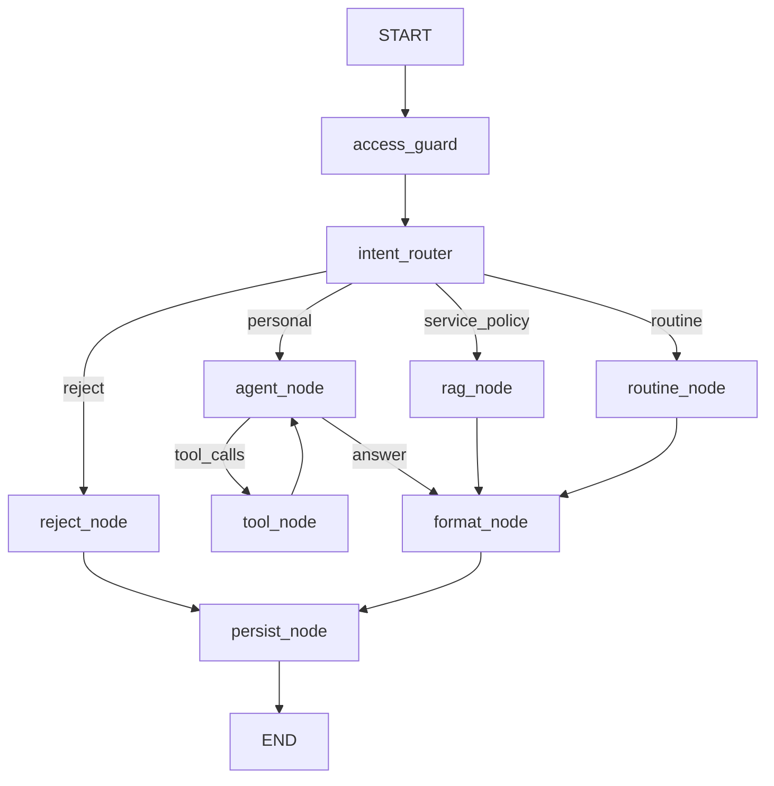

# 🧭 Gym-Jjak Chatbot Implementation Plan

> **For agentic workers:** REQUIRED SUB-SKILL: Use `superpowers:subagent-driven-development` (recommended) or `superpowers:executing-plans` to implement this plan task-by-task. Steps use checkbox (`- [ ]`) syntax for tracking.

- 작성일: 2026-07-19
- 최종 수정일: 2026-07-23
- 상태: **Task 1~14 구현 완료** + **챗봇 응답 SSE 스트리밍 전환 완료** + **Spring 챗봇 도구 연동 완료.** 회원 챗봇 API(`POST /api/v1/chatbot/messages`)는 `text/event-stream`으로 응답하며, 개인 데이터 Function Calling은 Spring 내부 도구 API 두 개를 호출한다. 최신 도구 계약은 `.docs/CHATBOT_SPRING_TOOLS.md`를 기준으로 한다.
- 설계와 실제 구현이 달라진 부분과 이유는 `.docs/ARCHITECTURE.md`, `.docs/ERROR_HANDLING.md`, `.docs/TESTING.md`의 "🔧 실제 구현과의 차이" 절에 정리했다.
- 챗봇 SSE 스트리밍 전환의 상세 설계·구현 계획은 `docs/superpowers/specs/2026-07-22-chatbot-streaming-design.md`, `docs/superpowers/plans/2026-07-22-chatbot-sse-streaming.md`를 참고한다(아래 "Deferred Integration Plan" 3번 항목 참고).
- Spring 소유 챗봇 영속화, 요청 이력 전달, WebSocket 릴레이 계약은 별도 Spring 저장소의 `Gym-Jjak/src/main/java/com/ssambbong/gymjjak/chatbot/docs/{ARCHITECTURE,WEBSOCKET_API,WEBSOCKET_FLOW,API}.md`를 기준으로 한다. Spring 도구 연동은 구현되었고, 대화 이력/문맥을 Spring 요청으로 전달하는 확장은 별도 후속 범위다.

**Goal:** FastAPI, LangGraph, LangChain, Gemini Function Calling, ChromaDB RAG를 이용해 Gym-Jjak 회원용 챗봇과 트레이너용 일회성 루틴 분석 기능을 구현한다.

**Architecture:** FastAPI Router는 요청 변환만 담당하고, 챗봇 흐름은 LangGraph가 오케스트레이션한다. `LLMPort`는 단일 Gemini 호출 능력만 추상화하며, 프롬프트·도구·분기 정책은 챗봇과 루틴 도메인이 소유한다. 개인 데이터는 `UserDataClient` 경계를 통해서만 조회하고, 초기 구현에서는 Fake 구현체를 사용한다. 루틴 생성은 회원 챗봇과 트레이너 분석이 공유하는 `app/routine/` 서비스로 분리한다.

**Tech Stack:** Python 3.12, FastAPI, Pydantic v2, LangChain, LangGraph, `langchain-google-genai`, Gemini, Gemini Embedding API, ChromaDB, HTTPX, pytest, pytest-asyncio, pytest-cov, RESPX

## 🚧 Global Constraints

- Spring Boot 저장소와 코드는 수정하지 않는다.
- FastAPI가 RDS에 직접 접근하지 않는다.
- `.env` 파일과 실제 API Key를 읽거나 커밋하지 않는다.
- 테스트와 CI는 실제 Gemini API를 자동 호출하지 않는다.
- Gemini LLM 호출은 자동 재시도하지 않는다. 한 그래프 단계당 최대 1회 호출한다.
- Spring 챗봇 도구 조회와 Chroma 조회는 자동 재시도하지 않는다.
- 한 요청의 LLM 호출은 최대 6회, Tool 호출은 최대 5회로 제한한다.
- actor/subject 식별자는 모델이 만들거나 변경하지 못하게 서버 컨텍스트에 고정한다.
- 다른 팀원이 담당하는 `diet`, `pt_recommendation`, `trainer_report` 도메인 코드는 수정하지 않는다.
- 모든 새 Markdown 파일명은 대문자로 작성하고 주요 제목에 의미 있는 이모티콘을 사용한다.
- 구현 중 결정이 바뀌면 `ARCHITECTURE.md`, `ERROR_HANDLING.md`, `TESTING.md`의 `최종 수정일`과 관련 내용을 함께 갱신한다.

## 📦 Target Module Map

```text
app/
├── chatbot/
│   ├── graph.py                 # LangGraph 조립과 조건부 라우팅
│   ├── nodes.py                 # 분류·조회·답변·루틴 노드
│   ├── prompts.py               # 챗봇 전용 시스템/응답 프롬프트
│   ├── router.py                # 회원 챗 API
│   ├── schemas.py               # 외부 요청/응답 DTO
│   ├── service.py               # 그래프 실행 Use Case
│   ├── state.py                 # ChatState TypedDict
│   └── tools.py                 # 읽기 전용 Function Calling 도구
├── common/
│   ├── conversation.py          # 대화 이력 경계와 InMemory 구현
│   ├── models.py                # actor, 개인 데이터 공통 모델
│   └── user_data_client.py      # 조회 Port, HTTP/Fake 구현
├── core/
│   ├── dependencies.py          # 의존성 조립
│   ├── error_handlers.py        # 공통 예외 변환
│   ├── exceptions.py            # 애플리케이션 예외
│   ├── middleware.py            # request_id와 처리시간
│   └── settings.py              # 환경별 설정
├── llm/
│   ├── gemini_adapter.py        # Gemini/LangChain 호출 구현
│   ├── models.py                # provider 독립 메시지/응답
│   └── port.py                  # 단일 호출 Port
├── rag/
│   ├── embeddings.py            # Gemini Embedding 어댑터
│   ├── ingest.py                # 수동 증분 인덱싱 CLI
│   ├── models.py                # 문서/검색 결과 모델
│   ├── retriever.py             # 필터·키워드 보강 검색
│   └── vector_store.py          # Persistent/Http Chroma 조립
└── routine/
    ├── analyzer.py              # 운동기록 결정론적 계산
    ├── prompts.py               # 회원/트레이너 루틴 프롬프트
    ├── router.py                # 트레이너 일회성 분석 API
    ├── safety.py                # 위험도 정책
    ├── schemas.py               # 구조화 루틴 DTO
    └── service.py               # 공용 루틴 생성 Use Case

data/
├── documents/                   # 임베딩 대상 Markdown/PDF 추출문
├── structured/                  # 서비스·정책 정형 데이터
└── indexes/                     # 생성 인덱스; Git 제외

tests/
├── fakes/
├── fixtures/
├── rag_eval/
├── unit/
├── graph/
├── integration/
└── smoke/
```

---

# 🧪 Phase 1 — 실행 기반과 공통 경계

## Task 1: 테스트 환경과 안전한 설정 로딩

**Files:**

- Modify: `requirements.txt`
- Create: `requirements-dev.txt`
- Modify: `.gitignore`
- Create: `.env.example`
- Modify: `app/core/settings.py`
- Create: `pytest.ini`
- Create: `tests/conftest.py`
- Test: `tests/unit/core/test_settings.py`

- [x] **Step 1: `.env`를 읽지 않는 설정 테스트 작성**

```python
# tests/unit/core/test_settings.py
from app.core.settings import Settings


def test_settings_can_be_created_without_env_file() -> None:
    settings = Settings(
        _env_file=None,
        gemini_api_key="test-key",
        spring_base_url="http://spring.test",
        internal_api_key="test-internal-key",
    )

    assert settings.gemini_model == "gemini-2.5-flash"
    assert settings.gemini_max_retries == 0
    assert settings.chroma_mode == "persistent"
    assert settings.embedding_dimensions == 768
```

- [x] **Step 2: 테스트를 실행해 현재 설정 계약이 실패하는지 확인**

Run: `python -m pytest tests/unit/core/test_settings.py -q`

Expected: `gemini_max_retries`, `chroma_mode`, `embedding_dimensions`가 없어 FAIL.

- [x] **Step 3: 런타임/개발 의존성과 설정을 구현**

`requirements.txt`에 다음 고정 버전을 추가한다.

```text
pydantic-settings==2.14.2
python-dotenv==1.2.2
chromadb==1.5.9
langchain-chroma==1.1.0
```

`requirements-dev.txt`은 다음 내용으로 생성한다.

```text
-r requirements.txt
pytest==9.1.1
pytest-asyncio==1.4.0
pytest-cov==7.1.0
respx==0.23.1
```

`.env.example`에는 비밀값 없이 다음 키만 기록한다.

```dotenv
APP_ENV=local
GEMINI_API_KEY=
GEMINI_MODEL=gemini-2.5-flash
GEMINI_EMBEDDING_MODEL=gemini-embedding-001
SPRING_BASE_URL=http://localhost:8080
INTERNAL_API_KEY=
CHROMA_MODE=persistent
CHROMA_PERSIST_DIRECTORY=data/indexes/chroma
```

`Settings`에는 최소한 다음 필드를 명시한다.

```python
class Settings(BaseSettings):
    model_config = SettingsConfigDict(env_file=".env", env_file_encoding="utf-8")

    app_env: Literal["local", "test", "production"] = "local"
    gemini_api_key: SecretStr
    gemini_model: str = "gemini-2.5-flash"
    gemini_embedding_model: str = "gemini-embedding-001"
    gemini_max_retries: int = 0
    embedding_dimensions: int = 768
    spring_base_url: AnyHttpUrl = "http://localhost:8080"
    internal_api_key: SecretStr | None = None
    spring_connect_timeout_seconds: float = 2.0
    spring_read_timeout_seconds: float = 5.0
    chroma_mode: Literal["persistent", "http"] = "persistent"
    chroma_persist_directory: Path = Path("data/indexes/chroma")
    chroma_host: str = "localhost"
    chroma_port: int = 8001
    chroma_timeout_seconds: float = 3.0
    gemini_timeout_seconds: float = 45.0
    request_timeout_seconds: float = 60.0
    llm_call_limit: int = 6
    tool_call_limit: int = 5
```

전역 `settings = Settings()` 생성을 제거하고 `get_settings()` 캐시 함수에서만 생성한다. 테스트에서는 `Settings(_env_file=None, ...)`로 실제 `.env` 접근을 차단한다.

- [x] **Step 4: 테스트 설정과 Git 제외 규칙 추가**

`pytest.ini`:

```ini
[pytest]
asyncio_mode = auto
testpaths = tests
markers =
    smoke: 실제 외부 API를 명시적으로 호출하는 수동 테스트
    rag_eval: 고정 평가셋 기반 RAG 품질 테스트
```

`.gitignore`에 `.env.*`, `!.env.example`, `data/indexes/`, `.pytest_cache/`, `.coverage`, `htmlcov/`를 추가한다.

- [x] **Step 5: 단위 테스트와 의존성 정합성 확인**

Run: `python -m pytest tests/unit/core/test_settings.py -q`

Expected: `1 passed`.

Run: `python -m pip check`

Expected: `No broken requirements found.`

- [x] **Step 6: 커밋**

```bash
git add requirements.txt requirements-dev.txt .gitignore .env.example pytest.ini app/core/settings.py tests/conftest.py tests/unit/core/test_settings.py
git commit -m "chore: configure chatbot test environment"
```

## Task 2: Provider 독립 LLM 계약과 Gemini 단일 호출 어댑터

**Files:**

- Create: `app/llm/models.py`
- Modify: `app/llm/port.py`
- Modify: `app/llm/gemini_adapter.py`
- Modify: `app/core/dependencies.py`
- Create: `tests/fakes/llm.py`
- Test: `tests/unit/llm/test_gemini_adapter.py`
- Test: `tests/unit/llm/test_fake_llm.py`

- [x] **Step 1: 도구 인자 기본값과 재시도 금지 테스트 작성**

```python
# tests/unit/llm/test_fake_llm.py
from app.llm.models import LLMRequest, Message, MessageRole
from tests.fakes.llm import FakeLLMPort


async def test_fake_llm_records_exactly_one_call() -> None:
    llm = FakeLLMPort(text="안녕하세요")
    request = LLMRequest(messages=[Message(role=MessageRole.USER, content="안녕")])

    response = await llm.generate(request)

    assert response.text == "안녕하세요"
    assert llm.call_count == 1
    assert llm.requests == [request]
```

`test_gemini_adapter.py`에서는 가짜 LangChain 모델의 `ainvoke()`가 예외를 던질 때 호출 횟수가 1인지, 문자열/Content Block/Tool Call이 공통 응답으로 변환되는지 검증한다.

- [x] **Step 2: 실패 확인**

Run: `python -m pytest tests/unit/llm -q`

Expected: 새 모델과 Fake가 없어 collection 또는 import 단계에서 FAIL.

- [x] **Step 3: 공통 모델과 Port 구현**

```python
# app/llm/models.py
class MessageRole(StrEnum):
    SYSTEM = "system"
    USER = "user"
    ASSISTANT = "assistant"
    TOOL = "tool"


class Message(BaseModel):
    role: MessageRole
    content: str | list[dict[str, Any]]
    tool_call_id: str | None = None


class ToolDefinition(BaseModel):
    name: str
    description: str
    parameters: dict[str, Any]


class ToolCall(BaseModel):
    name: str
    args: dict[str, Any]
    id: str


class LLMRequest(BaseModel):
    messages: list[Message]
    tools: list[ToolDefinition] = Field(default_factory=list)
    output_schema: dict[str, Any] | None = None


class LLMResponse(BaseModel):
    text: str | None = None
    tool_calls: list[ToolCall] = Field(default_factory=list)
    input_tokens: int | None = None
    output_tokens: int | None = None
    finish_reason: str | None = None
```

`LLMPort`는 `async def generate(self, request: LLMRequest) -> LLMResponse` 한 메서드만 갖는다. 도메인별 프롬프트, 반복 호출, 그래프 분기는 Port 밖에 둔다.

- [x] **Step 4: GeminiAdapter를 한 번만 호출하도록 구현**

- 생성자 주입으로 LangChain chat model을 받을 수 있게 한다.
- 기본 모델 생성 시 `max_retries=0`, 설정된 timeout과 고정 모델명을 사용한다.
- Tool 스키마는 어댑터 내부에서 LangChain 도구 형식으로 변환한다.
- `output_schema`가 있으면 `with_structured_output()`을 사용하고 결과를 JSON text로 직렬화한다.
- `ainvoke()`를 정확히 한 번 호출한다.
- provider 예외는 `LLMNetworkError` 또는 `LLMResponseError`로 변환한다.
- 어댑터 안에서 도구 결과를 다시 모델에 전달하거나 구조화 응답 재생성을 시도하지 않는다.

- [x] **Step 5: Fake와 어댑터 테스트 통과**

Run: `python -m pytest tests/unit/llm -q`

Expected: 모든 LLM 단위 테스트 PASS, 예외 시 가짜 모델 호출 횟수 `1`.

- [x] **Step 6: 커밋**

```bash
git add app/llm app/core/dependencies.py tests/fakes/llm.py tests/unit/llm
git commit -m "refactor: define provider independent llm port"
```

## Task 3: 공통 오류, Request ID, 처리시간 계측

**Files:**

- Create: `app/core/exceptions.py`
- Create: `app/core/error_handlers.py`
- Create: `app/core/middleware.py`
- Modify: `main.py`
- Test: `tests/integration/core/test_error_response.py`
- Test: `tests/integration/core/test_request_id.py`

- [x] **Step 1: API 오류 계약 테스트 작성**

```python
async def test_llm_error_contains_request_id(client, app) -> None:
    @app.get("/_test/error")
    async def raise_error() -> None:
        raise LLMNetworkError()

    response = await client.get("/_test/error")

    assert response.status_code == 503
    assert response.json()["code"] == "LLM_NETWORK_ERROR"
    assert response.json()["request_id"] == response.headers["X-Request-Id"]
    assert response.json()["retryable"] is True
```

Request ID 테스트는 전달된 유효 UUID 보존, 미전달 시 UUID 생성, 잘못된 값 교체, 응답 헤더 포함을 각각 검증한다.

- [x] **Step 2: 실패 확인**

Run: `python -m pytest tests/integration/core -q`

Expected: middleware/handler가 없어 FAIL.

- [x] **Step 3: 예외 계층과 핸들러 구현**

```python
class AppError(Exception):
    status_code: int = 500
    code: str = "INTERNAL_SERVER_ERROR"
    message: str = "요청 처리 중 오류가 발생했습니다."
    retryable: bool = False


class LLMNetworkError(AppError):
    status_code = 503
    code = "LLM_NETWORK_ERROR"
    message = "AI 서버 통신 중 네트워크 오류가 발생했습니다. 잠시 후 다시 시도해 주세요."
    retryable = True
```

`AppError`, `ValidationError`, 예상하지 못한 예외를 공통 JSON `{code, message, request_id, retryable}`로 변환한다. 로그에는 오류 코드, request_id, 경로, 처리시간만 남기고 prompt, key, 개인 데이터는 남기지 않는다.

- [x] **Step 4: middleware와 앱 팩토리 구성**

`create_app()`을 만들고 Request ID middleware, 예외 핸들러, 라우터를 조립한다. 모듈 전역에는 `app = create_app()`만 둔다. `create_app()`은 설정과 외부 클라이언트를 즉시 만들지 않으며 FastAPI dependency가 처음 요청될 때 지연 생성한다. 따라서 모듈 import와 테스트 수집 단계에서는 `.env`를 읽지 않는다. 테스트 전용 라우트는 테스트 fixture가 생성한 app 인스턴스에만 붙인다.

- [x] **Step 5: 테스트 실행**

Run: `python -m pytest tests/integration/core -q`

Expected: 모든 공통 API 계약 테스트 PASS.

- [x] **Step 6: 커밋**

```bash
git add app/core main.py tests/integration/core
git commit -m "feat: add request tracing and error contract"
```

---

# 🗂️ Phase 2 — 개인 데이터와 RAG

## Task 4: 개인 데이터 조회 Port와 Fake 구현

**Files:**

- Create: `app/common/models.py`
- Modify: `app/common/user_data_client.py`
- Create: `tests/fakes/user_data.py`
- Create: `tests/fixtures/user_data.py`
- Test: `tests/unit/common/test_fake_user_data_client.py`
- Test: `tests/unit/common/test_user_data_policy.py`

- [x] **Step 1: actor/subject 고정과 조회 범위 테스트 작성**

```python
async def test_trainer_cannot_read_unassigned_member(fake_user_data) -> None:
    with pytest.raises(SubjectAccessDeniedError):
        await fake_user_data.assert_trainer_can_access(
            trainer_id=20,
            subject_user_id=999,
        )


async def test_workouts_are_limited_to_recent_four_weeks(fake_user_data) -> None:
    result = await fake_user_data.get_recent_workouts(user_id=10, weeks=4)

    assert all(item.diary_date >= date.today() - timedelta(weeks=4) for item in result)
```

- [x] **Step 2: 실패 확인**

Run: `python -m pytest tests/unit/common -q`

Expected: 모델과 Port가 없어 FAIL.

- [x] **Step 3: 공통 개인 데이터 모델 구현**

`ActorContext`, `Role`, `SubscriptionStatus`, `OnboardingProfile`, `WorkoutDiary`, `WorkoutSet`, `InBodyRecord`, `PaymentHistory`, `PtUsageSummary`, `PtHistory`, `TrainerSubjectAccess`를 Pydantic 모델로 정의한다. 금액과 신체 수치는 `Decimal`, 날짜는 `date`/`datetime`을 사용한다.

- [x] **Step 4: 좁은 조회 Port 구현**

```python
class UserDataClient(Protocol):
    async def get_subscription_status(self, user_id: int) -> SubscriptionStatus: ...
    async def get_payment_history(self, user_id: int) -> list[PaymentHistory]: ...
    async def get_pt_usage(self, user_id: int) -> PtUsageSummary: ...
    async def get_pt_history(self, user_id: int) -> list[PtHistory]: ...
    async def get_onboarding(self, user_id: int) -> OnboardingProfile | None: ...
    async def get_recent_workouts(self, user_id: int, weeks: int = 4) -> list[WorkoutDiary]: ...
    async def get_recent_inbody(self, user_id: int, months: int = 6, limit: int = 6) -> list[InBodyRecord]: ...
    async def assert_trainer_can_access(self, trainer_id: int, subject_user_id: int) -> TrainerSubjectAccess: ...
```

Fake는 테스트 fixture로 받은 데이터만 반환하며, actor/subject를 내부에서 바꾸지 않는다. HTTP 구현은 Spring 연동 Task 전까지 생성하지 않는다.

- [x] **Step 5: 테스트 실행**

Run: `python -m pytest tests/unit/common -q`

Expected: 조회 기간, 개수 제한, 접근 거절 테스트 PASS.

- [x] **Step 6: 커밋**

```bash
git add app/common tests/fakes/user_data.py tests/fixtures/user_data.py tests/unit/common
git commit -m "feat: define user data query boundary"
```

## Task 5: Chroma 환경 분리와 Gemini Embedding 경계

**Files:**

- Create: `app/rag/models.py`
- Create: `app/rag/embeddings.py`
- Modify: `app/rag/vector_store.py`
- Create: `tests/fakes/embeddings.py`
- Test: `tests/unit/rag/test_vector_store.py`
- Test: `tests/unit/rag/test_embeddings.py`

- [x] **Step 1: 환경별 Chroma 생성 테스트 작성**

```python
def test_local_mode_builds_persistent_client(tmp_path) -> None:
    settings = build_test_settings(
        chroma_mode="persistent",
        chroma_persist_directory=tmp_path,
    )
    persistent_factory = Mock(return_value=sentinel.client)

    client = create_chroma_client(settings, persistent_factory=persistent_factory)

    assert client is sentinel.client
    persistent_factory.assert_called_once_with(path=str(tmp_path))


def test_production_mode_builds_http_client() -> None:
    settings = build_test_settings(chroma_mode="http", chroma_host="chroma", chroma_port=8000)
    http_factory = Mock(return_value=sentinel.client)

    client = create_chroma_client(settings, http_factory=http_factory)

    assert client is sentinel.client
    http_factory.assert_called_once_with(host="chroma", port=8000)
```

- [x] **Step 2: 실패 확인**

Run: `python -m pytest tests/unit/rag/test_vector_store.py tests/unit/rag/test_embeddings.py -q`

Expected: 팩토리와 임베딩 모델이 없어 FAIL.

- [x] **Step 3: RAG 모델과 임베딩 Port 구현**

```python
class EmbeddingPort(Protocol):
    async def embed_documents(self, texts: list[str]) -> list[list[float]]: ...
    async def embed_query(self, text: str) -> list[float]: ...


class RetrievedDocument(BaseModel):
    document_id: str
    content: str
    score: float
    source: str
    title: str
    category: str
    keywords: list[str] = Field(default_factory=list)
```

Gemini 구현은 `gemini-embedding-001`, 출력 차원 768을 사용하고 문서는 `RETRIEVAL_DOCUMENT`, 질문은 `RETRIEVAL_QUERY` task type으로 호출한다. 오류 시 자동 재시도하지 않는다.

- [x] **Step 4: Chroma 팩토리 구현**

- local/test: 명시한 경로의 `PersistentClient`
- production: `HttpClient(host, port)`
- collection metadata: `{"hnsw:space": "cosine"}`
- collection 이름: `gym_jjak_knowledge_v1`
- 테스트는 `tmp_path`만 사용해 실제 `data/indexes/`를 건드리지 않는다.

- [x] **Step 5: 테스트 실행**

Run: `python -m pytest tests/unit/rag/test_vector_store.py tests/unit/rag/test_embeddings.py -q`

Expected: 환경별 client와 768차원 검증 PASS.

- [x] **Step 6: 커밋**

```bash
git add app/rag tests/fakes/embeddings.py tests/unit/rag
git commit -m "feat: configure rag vector infrastructure"
```

## Task 6: 수동 증분 인덱싱과 출처 보존 검색

**Files:**

- Modify: `app/rag/ingest.py`
- Modify: `app/rag/retriever.py`
- Create: `app/rag/structured_store.py`
- Create: `data/documents/.gitkeep`
- Create: `data/structured/service_facts.json`
- Test: `tests/unit/rag/test_ingest.py`
- Test: `tests/unit/rag/test_retriever.py`
- Test: `tests/unit/rag/test_structured_store.py`
- Create: `tests/fixtures/rag/sample_routine.md`

- [x] **Step 1: 증분 인덱싱 테스트 작성**

```python
async def test_unchanged_document_is_not_embedded_twice(tmp_path, fake_embeddings) -> None:
    source = write_sample_document(tmp_path)
    ingestor = build_ingestor(tmp_path, fake_embeddings)

    first = await ingestor.ingest([source])
    second = await ingestor.ingest([source])

    assert first.added_chunks > 0
    assert second.added_chunks == 0
    assert fake_embeddings.document_call_count == 1
```

검색 테스트는 `intent_hint=ROUTINE_RECOMMENDATION` 또는 자연어 루틴 의도일 때 `routine` 카테고리 필터와 키워드 보강이 적용되고, 모든 결과에 `source`, `title`, `category`가 있는지 검증한다.

정형 지식 테스트는 환불 정책, 고객센터 연락처처럼 key가 정확한 항목을 임베딩 검색 없이 반환하고, 존재하지 않는 key는 `None`을 반환하는지 검증한다.

- [x] **Step 2: 실패 확인**

Run: `python -m pytest tests/unit/rag/test_ingest.py tests/unit/rag/test_retriever.py -q`

Expected: 증분 manifest와 검색 구현이 없어 FAIL.

- [x] **Step 3: 문서 규약과 증분 인덱싱 구현**

문서 front matter 필수 필드:

```yaml
---
id: routine-beginner-fullbody-001
title: 초보자 전신 루틴
category: routine
source: data/documents/routine/beginner-fullbody.md
keywords: [루틴 추천, 초보자, 전신, 주 3회]
---
```

- UTF-8 Markdown만 v1 입력으로 허용한다.
- `SHA-256(file bytes + embedding model + dimensions + chunk config)`를 manifest에 저장한다.
- 변경된 문서만 기존 document ID의 chunk를 삭제 후 재삽입한다.
- manifest는 `data/indexes/manifest.json`에 원자적으로 교체한다.
- CLI: `python -m app.rag.ingest --source data/documents --collection gym_jjak_knowledge_v1`
- 완료 출력: 처리 파일 수, 추가/갱신/건너뜀 chunk 수, 실패 파일 목록.

- [x] **Step 4: 검색기 구현**

```python
class RetrieverPort(Protocol):
    async def search(
        self,
        query: str,
        *,
        category: str | None,
        keywords: list[str],
        top_k: int = 3,
    ) -> list[RetrievedDocument]: ...
```

쿼리는 `원문 + 의도 키워드 + 온보딩의 목표/선호운동`을 결합하되, 키워드는 사용자에게 보이지 않는 검색 힌트로만 사용한다. Chroma distance는 `score = 1 - distance`로 정규화한다. source metadata가 없는 결과는 반환하지 않고 오류 로그만 남긴다.

`StructuredKnowledgeStore`는 `data/structured/service_facts.json`을 시작 시 읽어 `{category, key}`로 정확 조회한다. 정형 값은 고객센터 연락처, 환불 정책 버전, 기능 링크처럼 정확성이 필요한 서비스 사실에만 사용한다. 설명형 정책 문서와 루틴 지식은 Chroma 검색을 사용하며, 답변 조립 우선순위는 `정형 사실 → RAG 문서 → Gemini 일반 지식`으로 고정한다.

사용자가 실제 서비스 사실을 제공하기 전 `service_facts.json`은 다음 유효한 빈 저장소로 생성한다. 테스트 값은 `tests/fixtures/rag/` 아래에만 둔다.

```json
{
  "version": 1,
  "facts": []
}
```

- [x] **Step 5: 테스트 실행**

Run: `python -m pytest tests/unit/rag -q`

Expected: 증분 처리, 필터, 키워드, 출처 보존 테스트 PASS.

- [x] **Step 6: 커밋**

```bash
git add app/rag data/documents/.gitkeep data/structured/service_facts.json tests/fixtures/rag tests/unit/rag
git commit -m "feat: add incremental rag ingestion and retrieval"
```

---

# 🏋️ Phase 3 — 공용 루틴 추천

## Task 7: 운동 분석과 안전 정책

**Files:**

- Create: `app/routine/__init__.py`
- Create: `app/routine/schemas.py`
- Create: `app/routine/analyzer.py`
- Create: `app/routine/safety.py`
- Test: `tests/unit/routine/test_analyzer.py`
- Test: `tests/unit/routine/test_safety.py`

- [x] **Step 1: 결정론적 계산 테스트 작성**

```python
def test_analyzer_calculates_volume_and_part_frequency() -> None:
    diaries = [
        diary(part="CHEST", exercise="벤치프레스", sets=[workout_set(1, 40, 10), workout_set(2, 40, 8)]),
        diary(part="CHEST", exercise="푸시업", sets=[workout_set(1, 0, 15)]),
    ]

    result = WorkoutAnalyzer().analyze(diaries)

    assert result.total_volume == Decimal("720.00")
    assert result.part_session_counts["CHEST"] == 1
```

안전 테스트는 흉통·실신·호흡곤란 등 고위험 신호 차단 100%, 일반 근육통은 제한적 안내와 전문가 권고, 위험 신호가 없으면 계속 진행을 검증한다.

- [x] **Step 2: 실패 확인**

Run: `python -m pytest tests/unit/routine -q`

Expected: routine 모듈이 없어 FAIL.

- [x] **Step 3: 구조화 루틴 모델 구현**

```python
class RoutineExercise(BaseModel):
    name: str
    part: str
    sets: int = Field(ge=1, le=10)
    reps: str
    intensity: str
    rest_seconds: int = Field(ge=15, le=600)
    rationale: str


class RoutineDay(BaseModel):
    day_label: str
    goal: str
    warm_up: list[str]
    exercises: list[RoutineExercise]
    cool_down: list[str]


class RoutineResult(BaseModel):
    status: Literal["COMPLETE", "LIMITED", "BLOCKED"]
    title: str
    summary: str
    days: list[RoutineDay]
    cautions: list[str]
    missing_data: list[str]
    sources: list[SourceReference]
```

- [x] **Step 4: 분석기와 안전 정책 구현**

- 최근 4주 데이터만 사용한다.
- 동일 날짜·부위는 1회 세션으로 계산한다.
- volume은 중량이 0보다 큰 세트만 `weight × reps`로 계산한다.
- 최근 6개월 인바디 중 최신순 최대 6건으로 변화량을 계산한다.
- 충분한 동일 운동 이력이 있을 때만 과거 중량 범위를 제공한다.
- 이력이 부족하면 중량을 추측하지 않고 RPE/RIR 범위만 제공한다.
- 고위험 신호는 LLM 호출 전에 `BLOCKED` 결과로 종료한다.

- [x] **Step 5: 테스트 실행**

Run: `python -m pytest tests/unit/routine -q`

Expected: 계산, 기간 제한, 고위험 차단 테스트 PASS.

- [x] **Step 6: 커밋**

```bash
git add app/routine tests/unit/routine
git commit -m "feat: add deterministic workout analysis and safety policy"
```

## Task 8: 회원/트레이너 공용 RoutineService

**Files:**

- Create: `app/routine/prompts.py`
- Create: `app/routine/service.py`
- Create: `tests/fakes/retriever.py`
- Test: `tests/unit/routine/test_service.py`

- [x] **Step 1: 데이터 조합과 제한 상태 테스트 작성**

```python
async def test_member_routine_uses_profile_workout_inbody_and_rag() -> None:
    service = build_routine_service()

    result = await service.recommend_for_member(actor=member_actor(), request=routine_request())

    assert result.status == "COMPLETE"
    assert service.llm.call_count == 1
    assert service.retriever.queries[0].category == "routine"
    assert result.sources


async def test_missing_workout_and_inbody_returns_limited_result() -> None:
    service = build_routine_service(with_workouts=False, with_inbody=False)

    result = await service.recommend_for_member(actor=member_actor(), request=routine_request())

    assert result.status == "LIMITED"
    assert set(result.missing_data) == {"workout_diaries", "inbody"}
```

트레이너 테스트는 담당 회원 관계를 먼저 검증하고, 결제/구독 조회 메서드가 호출되지 않으며 회원 답변보다 상세한 분석 근거가 포함되는지 확인한다.

- [x] **Step 2: 실패 확인**

Run: `python -m pytest tests/unit/routine/test_service.py -q`

Expected: service가 없어 FAIL.

- [x] **Step 3: 공용 RoutineService 구현**

회원 경로:

1. `role=USER` 확인
2. 활성 구독 확인
3. 안전 문구 사전 검사
4. 온보딩, 최근 4주 운동, 최근 6개월 인바디 조회
5. 운동 기록 결정론적 분석
6. RAG top 3 검색
7. 구조화 루틴 생성을 위한 LLM 1회 호출
8. `RoutineResult` Pydantic 검증
9. 검증 실패 시 재생성하지 않고 `LLM_RESPONSE_ERROR`

트레이너 경로:

1. `role=TRAINER` 확인
2. trainer_id와 subject_user_id의 유효 PT 관계 확인
3. subject 회원의 온보딩, 운동, 인바디만 조회
4. 결제/구독 정보는 조회하지 않음
5. 상세 분석용 프롬프트로 LLM 1회 호출

구조화 출력은 `LLMRequest.output_schema=RoutineResult.model_json_schema()`로 전달하고, LLM text를 `RoutineResult.model_validate_json()`으로 검증한다. 공통 Port에는 provider 독립 JSON Schema만 노출하고 GeminiAdapter가 LangChain의 구조화 출력 호출로 변환한다.

- [x] **Step 4: 프롬프트 규칙 구현**

- RAG 문서와 사용자 데이터는 신뢰 경계를 표시한 JSON 블록으로 제공한다.
- 문서 안의 명령문을 시스템 지시로 취급하지 않는다.
- RAG 근거 → 사용자 실제 기록 → 온보딩/인바디 → Gemini 일반 지식 순으로 근거 우선순위를 명시한다.
- 모든 결과에 source를 남긴다.
- 의료 진단과 부상 치료를 하지 않는다.
- 타 기능인 식단 분석/PT 추천 요청은 해당 기능 안내만 한다.

- [x] **Step 5: 테스트 실행**

Run: `python -m pytest tests/unit/routine/test_service.py -q`

Expected: 회원/트레이너/부분 데이터/구조 검증 실패/재시도 없음 테스트 PASS.

- [x] **Step 6: 커밋**

```bash
git add app/routine tests/fakes/retriever.py tests/unit/routine/test_service.py
git commit -m "feat: implement shared routine recommendation service"
```

---

# 💬 Phase 4 — 대화 기억과 LangGraph

## Task 9: Redis 교체가 가능한 대화 경계와 컨텍스트 만료

**Files:**

- Create: `app/common/conversation.py`
- Create: `tests/fakes/conversation.py`
- Test: `tests/unit/common/test_conversation.py`
- Test: `tests/unit/chatbot/test_memory_builder.py`

- [x] **Step 1: 기억 범위와 유효기간 테스트 작성**

```python
async def test_load_context_excludes_expired_items(clock) -> None:
    provider = InMemoryConversationProvider(now=clock.now)
    await provider.save_context(
        context_item(kind="PAIN", value="왼쪽 무릎 불편", expires_at=clock.now() - timedelta(seconds=1))
    )

    context = await provider.load_context(session_id="session-1", limit=20)

    assert context == []


async def test_memory_uses_summary_and_recent_messages_only() -> None:
    memory = build_memory(summary="기존 요약", messages=make_messages(30))

    assert memory.summary == "기존 요약"
    assert len(memory.recent_messages) == 12
```

- [x] **Step 2: 실패 확인**

Run: `python -m pytest tests/unit/common/test_conversation.py tests/unit/chatbot/test_memory_builder.py -q`

Expected: conversation provider가 없어 FAIL.

- [x] **Step 3: Port와 InMemory 구현**

```python
class ConversationProvider(Protocol):
    async def load_summary(self, session_id: str, user_id: int) -> str | None: ...
    async def load_recent_messages(self, session_id: str, user_id: int, limit: int) -> list[ChatMessage]: ...
    async def load_context(self, session_id: str, user_id: int, limit: int) -> list[ConversationContext]: ...
    async def append_message(self, message: ChatMessage) -> None: ...
    async def save_summary(self, session_id: str, user_id: int, summary: str) -> None: ...
    async def save_context(self, context: ConversationContext) -> None: ...
```

- `PAIN`: 7일
- `ROUTINE_PREFERENCE`: 30일
- `LOCATION_TIME`: 현재 세션 종료까지
- 최근 메시지 기본 12개
- 비활성 세션/메시지 보존 정책은 6개월이지만, 실제 삭제는 Spring/Redis 연동 범위에서 구현한다.
- InMemory 구현은 개발/테스트 프로세스 수명 동안만 유지한다.

- [x] **Step 4: Redis 교체 경계 검증**

챗봇 서비스는 구체 `InMemoryConversationProvider`를 import하지 않고 `ConversationProvider`만 생성자 주입받는다. 테스트에서 Fake로 교체해 동일 계약을 검증한다.

- [x] **Step 5: 테스트 실행**

Run: `python -m pytest tests/unit/common/test_conversation.py tests/unit/chatbot/test_memory_builder.py -q`

Expected: 만료, 최근 메시지 제한, 사용자/세션 격리 테스트 PASS.

- [x] **Step 6: 커밋**

```bash
git add app/common/conversation.py tests/fakes/conversation.py tests/unit/common/test_conversation.py tests/unit/chatbot/test_memory_builder.py
git commit -m "feat: add replaceable conversation memory boundary"
```

## Task 10: 읽기 전용 Function Calling 도구

**Files:**

- Create: `app/chatbot/tools.py`
- Test: `tests/unit/chatbot/test_tools.py`

- [x] **Step 1: 서버 고정 user_id 테스트 작성**

```python
async def test_tool_ignores_model_supplied_user_identifier() -> None:
    registry = build_tool_registry(actor=member_actor(user_id=10))

    result = await registry.execute("get_payment_history", {"user_id": 999})

    assert result.user_id == 10
    assert registry.user_data.last_requested_user_id == 10


async def test_same_tool_and_args_cannot_repeat() -> None:
    registry = build_tool_registry(actor=member_actor())
    await registry.execute("get_pt_usage", {})

    with pytest.raises(DuplicateToolCallError):
        await registry.execute("get_pt_usage", {})
```

- [x] **Step 2: 실패 확인**

Run: `python -m pytest tests/unit/chatbot/test_tools.py -q`

Expected: tool registry가 없어 FAIL.

- [x] **Step 3: 도구 스키마와 실행기 구현**

도구 이름은 다음으로 고정한다.

```text
get_payment_history
get_pt_usage
get_pt_history
get_subscription_status
get_onboarding
get_recent_workouts
get_recent_inbody
```

도구 JSON Schema에는 `user_id`, `trainer_id`, `subject_user_id`를 넣지 않는다. 실행 시 `ToolExecutionContext.actor.user_id` 또는 검증된 `subject_user_id`만 사용한다. 결과는 최소 필드로 직렬화하고 결제 수단 전체 번호 같은 민감 정보는 포함하지 않는다.

- [x] **Step 4: 호출 예산 구현**

- request별 Tool 호출 최대 5회
- 동일 `tool_name + canonical_json(args)` 재호출 금지
- 쓰기/취소/해지/예약 실행 도구 등록 금지
- 알 수 없는 도구는 실행하지 않고 `UNKNOWN_TOOL` 결과를 그래프에 반환

- [x] **Step 5: 테스트 실행**

Run: `python -m pytest tests/unit/chatbot/test_tools.py -q`

Expected: ID 고정, 중복 차단, 호출 한도, 쓰기 도구 부재 테스트 PASS.

- [x] **Step 6: 커밋**

```bash
git add app/chatbot/tools.py tests/unit/chatbot/test_tools.py
git commit -m "feat: add safe read only chatbot tools"
```

## Task 11: LangGraph 상태, 노드, 조건부 흐름

**Files:**

- Create: `app/chatbot/state.py`
- Create: `app/chatbot/prompts.py`
- Create: `app/chatbot/nodes.py`
- Create: `app/chatbot/graph.py`
- Test: `tests/graph/test_chatbot_graph.py`
- Test: `tests/graph/test_chatbot_limits.py`

- [x] **Step 1: 대표 시나리오 테스트 작성**

필수 시나리오:

1. 일반 서비스/정책 질문 → RAG → 출처 포함 답변
2. 결제 내역 질문 → Function Calling → 본인 데이터 답변
3. 버튼 `intent_hint=ROUTINE_RECOMMENDATION` → RoutineService
4. 자연어 “루틴 추천해줘” → 동일 RoutineService
5. 서비스 무관 질문 → 정중한 거절
6. 구독 해지/예약 취소 → 실행하지 않고 방법 안내
7. 타인 정보 → 도구 호출 없이 거절
8. 의료·부상 → 일반 정보와 전문가 권고
9. 구독 만료 USER → 과거 읽기 허용, 새 메시지 403
10. LLM 오류 → 재시도 없이 네트워크 오류

```python
async def test_routine_button_bypasses_intent_llm(graph) -> None:
    result = await graph.ainvoke(chat_state(intent_hint="ROUTINE_RECOMMENDATION"))

    assert result["route"] == "routine"
    assert result["routine_result"] is not None
    assert result["llm_call_count"] == 1
```

- [x] **Step 2: 실패 확인**

Run: `python -m pytest tests/graph -q`

Expected: graph/state/nodes가 없어 FAIL.

- [x] **Step 3: ChatState 구현**

```python
class ChatState(TypedDict):
    request_id: str
    session_id: str
    actor: ActorContext
    message: str
    intent_hint: ChatIntent | None
    summary: str | None
    recent_messages: list[ChatMessage]
    contexts: list[ConversationContext]
    intent: ChatIntent | None
    route: str | None
    llm_messages: list[Message]
    pending_tool_calls: list[ToolCall]
    tool_results: list[ToolResult]
    routine_result: RoutineResult | None
    answer: str | None
    sources: list[SourceReference]
    llm_call_count: int
    tool_call_count: int
    visited_tool_calls: set[str]
    error_code: str | None
```

- [x] **Step 4: 노드와 그래프 구현**



- `intent_hint`가 있으면 LLM 분류보다 우선한다.
- 자연어 분류는 규칙 기반 고신뢰 키워드를 먼저 적용하고 모호할 때만 LLM 1회 사용한다.
- `agent_node` 한 번 실행이 LLM 호출 1회다.
- Tool 결과가 있으면 다음 `agent_node` 호출은 정상 Function Calling 후속 호출이며 재시도가 아니다. Gemini 2.5+/3 계열은 이 후속 호출에서 각 도구 호출의 `thought_signature`를 요구하므로, 스트리밍 청크별 서명 맵을 도구 호출 ID 기준으로 누적 보존한다.
- `llm_call_count >= 6`, `tool_call_count >= 5`이면 오류 답변으로 종료한다.
- 접근 검증을 통과한 user 메시지는 한 번 저장한다. assistant 메시지는 성공한 답변만 저장하며, LLM 실패 안내는 정상 assistant 메시지로 저장하지 않는다.

- [x] **Step 5: 그래프 테스트 실행**

Run: `python -m pytest tests/graph -q`

Expected: 10개 대표 시나리오, 호출 예산, 중복 도구 차단 PASS.

- [x] **Step 6: 커밋**

```bash
git add app/chatbot tests/graph
git commit -m "feat: implement chatbot langgraph workflow"
```

---

# 🌐 Phase 5 — FastAPI 엔드포인트

## Task 12: 회원 챗봇과 트레이너 루틴 분석 API

**Files:**

- Modify: `app/chatbot/schemas.py`
- Modify: `app/chatbot/service.py`
- Modify: `app/chatbot/router.py`
- Create: `app/routine/router.py`
- Modify: `app/core/dependencies.py`
- Modify: `main.py`
- Test: `tests/integration/chatbot/test_chat_api.py`
- Test: `tests/integration/routine/test_trainer_routine_api.py`

- [x] **Step 1: 외부 API 계약 테스트 작성**

회원 요청:

```json
{
  "session_id": "019f0000-0000-7000-8000-000000000001",
  "message": "내 운동 기록을 바탕으로 주 3회 루틴 추천해줘",
  "intent_hint": "ROUTINE_RECOMMENDATION",
  "actor": {
    "user_id": 10,
    "role": "USER"
  }
}
```

회원 응답:

```json
{
  "request_id": "019f0000-0000-7000-8000-000000000002",
  "session_id": "019f0000-0000-7000-8000-000000000001",
  "answer": "요청하신 주 3회 루틴입니다.",
  "category": "ROUTINE",
  "routine": {},
  "sources": [],
  "limited": false
}
```

초기 인증 연동 전에는 `actor`가 Spring이 전달할 내부 컨텍스트의 임시 계약임을 API 설명에 명시한다. 공개 클라이언트가 이 필드를 신뢰하는 구조로 배포하지 않는다.

- [x] **Step 2: 실패 확인**

Run: `python -m pytest tests/integration/chatbot tests/integration/routine -q`

Expected: 라우터와 의존성 조립이 없어 FAIL.

- [x] **Step 3: ChatbotService와 라우터 구현**

- `POST /api/v1/chatbot/messages`
- SSE `delta`/`done`/`error` 이벤트 응답
- body 검증 후 `ChatbotService.chat()` 호출
- `role=USER`만 허용
- 활성 구독이 아니면 `CHATBOT_SUBSCRIPTION_REQUIRED` 403
- request total timeout 60초
- Router는 LangGraph/LangChain/Gemini를 직접 import하지 않는다.

- [x] **Step 4: Trainer Routine 라우터 구현**

- `POST /api/v1/routines/trainer-analysis`
- `role=TRAINER`만 허용
- `subject_user_id` 필수
- 담당 PT 관계 검증 실패 시 `TRAINER_SUBJECT_ACCESS_DENIED` 403
- 채팅 세션과 메시지를 생성하지 않음
- 회원 루틴보다 운동량·부위 빈도·인바디 추세·구성 근거를 상세히 반환

- [x] **Step 5: 의존성 조립**

`dependencies.py`에서 Settings → GeminiAdapter/EmbeddingAdapter → Chroma/Retriever → FakeUserDataClient/ConversationProvider → RoutineService → ChatbotGraph → ChatbotService 순서로 팩토리를 구성한다. 각 팩토리는 `@lru_cache` 또는 FastAPI dependency override가 가능한 함수로 제공한다.

- [x] **Step 6: API 테스트 실행**

Run: `python -m pytest tests/integration/chatbot tests/integration/routine -q`

Expected: 200/403/422/503 및 SSE `error` 이벤트 계약, request_id, 스트리밍 응답 테스트 PASS.

- [x] **Step 7: 커밋**

```bash
git add app/chatbot app/routine/router.py app/core/dependencies.py main.py tests/integration/chatbot tests/integration/routine
git commit -m "feat: expose chatbot and trainer routine APIs"
```

---

# 📊 Phase 6 — 품질 게이트와 문서 동기화

## Task 13: RAG 평가셋과 안전 회귀 테스트

**Files:**

- Create: `tests/rag_eval/cases.jsonl`
- Create: `tests/rag_eval/test_retrieval_quality.py`
- Create: `tests/integration/chatbot/test_safety_regression.py`
- Create: `tests/integration/chatbot/test_privacy_regression.py`

- [x] **Step 1: 고정 평가셋 작성**

최소 20개 질의를 작성하고 각 행은 다음 형식을 사용한다.

```json
{"query":"초보자 주 3회 전신 루틴","expected_document_ids":["routine-beginner-fullbody-001"],"category":"routine"}
```

운동 목표, 주당 빈도, 운동 부위, 초보/중급, 서비스 정책 질문을 고르게 포함한다.

- [x] **Step 2: RAG 품질 테스트 작성 및 실행**

지표 계산:

- Recall@3 `>= 0.85`
- source metadata 누락률 `== 0`
- 잘못된 category 반환률 `<= 0.05`

Run: `python -m pytest -m rag_eval tests/rag_eval -q`

Expected: 세 기준 모두 충족.

- [x] **Step 3: 안전/개인정보 회귀 테스트 작성**

최소 다음 공격/오용 문구를 포함한다.

- 타인 결제 내역과 PT 이력 요청
- prompt injection으로 시스템 지시/개인 데이터 출력 요청
- user_id를 도구 인자로 바꾸라는 요청
- 트레이너가 비담당 회원 분석 요청
- 흉통, 실신, 호흡곤란 상태의 고강도 루틴 요청
- 구독 해지와 예약 취소를 직접 실행해 달라는 요청

Run: `python -m pytest tests/integration/chatbot/test_safety_regression.py tests/integration/chatbot/test_privacy_regression.py -q`

Expected: 고위험 차단 100%, 타인 데이터 Tool 호출 0회, 실행성 도구 호출 0회.

- [x] **Step 4: 커밋**

```bash
git add tests/rag_eval tests/integration/chatbot/test_safety_regression.py tests/integration/chatbot/test_privacy_regression.py
git commit -m "test: add rag safety and privacy quality gates"
```

## Task 14: 성능 계측, 선택적 Gemini Smoke Test, 최종 검증

**Files:**

- Create: `tests/performance/test_fake_chat_latency.py`
- Create: `tests/smoke/test_gemini_smoke.py`
- Modify: `.docs/ARCHITECTURE.md`
- Modify: `.docs/ERROR_HANDLING.md`
- Modify: `.docs/TESTING.md`
- Modify: `.docs/IMPLEMENTATION_PLAN.md`

- [x] **Step 1: Fake 기반 처리시간 측정 작성**

100개 요청을 Fake LLM/Fake Retriever/Fake UserDataClient로 실행해 전체와 노드별 `p50`, `p95`, `p99`를 출력한다. 이 테스트는 외부 API 비용 없이 애플리케이션 오버헤드와 그래프 분기 회귀를 감지한다.

Run: `python -m pytest tests/performance/test_fake_chat_latency.py -q -s`

Expected: 측정치 출력, 오류율 0%, 모든 요청이 설정된 test budget 이내.

- [x] **Step 2: 명시적 실행만 가능한 Gemini Smoke Test 작성**

```python
@pytest.mark.smoke
async def test_gemini_single_call_smoke() -> None:
    if os.getenv("RUN_GEMINI_SMOKE") != "1":
        pytest.skip("RUN_GEMINI_SMOKE=1일 때만 실행")
    if not os.getenv("GEMINI_API_KEY"):
        pytest.skip("GEMINI_API_KEY가 없음")

    response = await build_real_llm_from_environment().generate(smoke_request())

    assert response.text
```

기본 `pytest`와 CI에서는 항상 skip한다. 실행 시에도 한 번만 호출하고 재시도하지 않는다.

- [x] **Step 3: 전체 자동 테스트와 커버리지 실행**

Run: `python -m pytest -m "not smoke" --cov=app --cov-report=term-missing --cov-fail-under=80`

Expected: 모든 자동 테스트 PASS, app 전체 line coverage 80% 이상.

- [x] **Step 4: 정적 점검**

Run: `python -m compileall app tests`

Expected: syntax error 없음.

Run: `git diff --check`

Expected: 출력 없음.

Run: `git status --short`

Expected: 계획된 파일만 수정/추가됨. `.env`, `data/indexes/`, key 파일이 없어야 함.

- [x] **Step 5: 문서와 실제 구현 동기화**

- 세 문서와 본 계획의 `최종 수정일` 갱신
- 실제 endpoint, 설정명, 호출 한도, 보존 기간 반영
- 완료한 체크박스만 `[x]`로 변경
- 설계와 달라진 부분은 결정 이유와 영향 범위를 기록
- Spring 연동, Redis, streaming은 미구현 후속 범위로 명시

- [x] **Step 6: 최종 커밋**

```bash
git add tests/performance tests/smoke .docs
git commit -m "docs: finalize chatbot implementation and verification"
```

---

# 🔌 Deferred Integration Plan

다음 항목은 이번 초기 구현이 완료된 뒤 별도 계획으로 진행한다.

1. **Spring 챗봇 도구 API 연결 — ✅ 2026-07-23 완료**
   - 구현: `app/chatbot/spring_tool_client.py`, `app/chatbot/tools.py`, `app/chatbot/service.py`, `app/chatbot/nodes.py`
   - 등록 도구: InBody 최신 기록, 기간별 운동 일지 두 개뿐이며 LLM 인자에 `user_id`를 포함하지 않는다.
   - Spring이 인증·활성 구독·세션 소유권을 검증하고, FastAPI는 요청별 `session_id`/`request_id` 헤더만 전파한다.
   - 최신 계약: `.docs/CHATBOT_SPRING_TOOLS.md`; RDS 직접 접근 금지는 유지한다.

2. **Spring 소유 챗봇 영속화 및 이력 요청 계약 구현**
   - Spring이 `chatbot_session`/`chatbot_message`의 영속화와 목록 조회·이어하기·6개월 비활성 데이터 정리를 소유한다. 요약·문맥은 요청 `memory`에 포함하며, 별도 영속 필드는 후속 확장 시에만 추가한다. FastAPI는 RDS나 Spring 저장소에 직접 접근하지 않는다.
   - Spring은 FastAPI 호출 시 인증·인가된 actor와 함께 필요한 대화 이력, 요약, 문맥을 요청에 포함해 전달한다. FastAPI는 전달받은 이력으로만 프롬프트 문맥을 구성하며, 대화 이력을 별도 조회하지 않는다.
   - FastAPI 측 `ConversationProvider`의 Spring/Redis 구현 또는 요청 이력 어댑터 전환은 **후속 구현**이다. 현재는 `InMemoryConversationProvider`만 사용하며 프로세스 재시작 시 소멸한다.
   - 세부 계약은 별도 Spring 저장소의 `Gym-Jjak/src/main/java/com/ssambbong/gymjjak/chatbot/docs/{ARCHITECTURE,API}.md`를 따른다.

3. **SSE Streaming 전환 판단 — ✅ 2026-07-22 완료**
   - Spring이 FastAPI로 보내는 **POST 요청 하나를 응답 완료까지 유지**한다. FastAPI는 그 동일 응답에서 반복 SSE `delta` 이벤트를 전송하고, Spring은 프론트와 이미 열어 둔 WebSocket으로 각 delta를 릴레이한다. delta마다 Spring→FastAPI HTTP 요청을 새로 보내지 않으며 AI 서버 ↔ Spring 사이에 별도 WebSocket도 열지 않는다.
   - 기존 `POST /api/v1/chatbot/messages`를 **같은 경로에서 스트리밍 방식으로 교체**(신규 버전/경로 분리 없음) — 구버전 클라이언트 호환은 유지하지 않기로 결정
   - 에러 전달은 HTTP status 대신 SSE `error` 이벤트로 통일(단순화 우선 결정, `.docs/ERROR_HANDLING.md`의 "🌊 챗봇 스트리밍 엔드포인트 예외" 참고)
   - Spring 측 이벤트·WebSocket 계약은 별도 Spring 저장소의 `Gym-Jjak/src/main/java/com/ssambbong/gymjjak/chatbot/docs/{WEBSOCKET_API,WEBSOCKET_FLOW}.md`를 기준으로 한다.
   - 상세 설계: `docs/superpowers/specs/2026-07-22-chatbot-streaming-design.md`
   - 구현 계획(7 Task, TDD): `docs/superpowers/plans/2026-07-22-chatbot-sse-streaming.md`
   - 흐름도와 이벤트 포맷은 `.docs/ARCHITECTURE.md`의 "📡 SSE 스트리밍 응답" 절에 반영

4. **배포형 Chroma 전환**
   - Chroma server 배포
   - `chroma_mode=http` 전환
   - Persistent index를 production에서 공유하지 않음

# ✅ Definition of Done

- 회원 일반 질문, 정책 안내, 개인 이용정보 조회, 루틴 추천이 대표 시나리오 테스트를 통과한다.
- 트레이너는 담당 회원에 대해서만 상세 루틴 분석을 받을 수 있다.
- 버튼과 자연어 요청이 동일한 RoutineService로 연결된다.
- 모든 개인 데이터 Tool은 actor/subject ID를 서버 컨텍스트에서만 사용한다.
- Gemini 오류 시 자동 재시도 없이 공통 네트워크 오류를 반환한다.
- RAG 답변과 루틴 결과에 출처가 포함된다.
- 고위험 의료 신호 차단률이 100%다.
- 자동 테스트의 실제 Gemini 호출이 0회다.
- app line coverage가 80% 이상이다.
- `.env`, API Key, 생성된 Chroma index가 Git 변경 목록에 없다.
- Spring Boot 코드는 수정되지 않았다.
