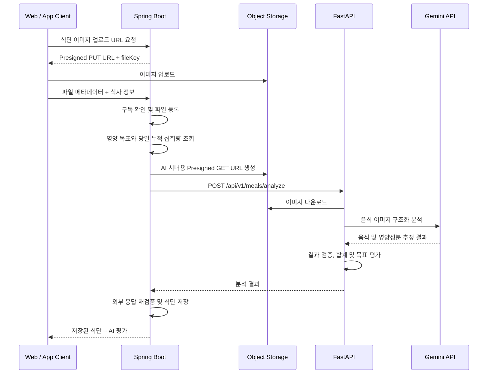

# 🍽️ Gym-Jjak Diet AI API Contract

- 작성일: 2026-07-20
- 최종 수정일: 2026-07-20
- 상태: 백엔드 구현 기준 초안
- 기준 백엔드 커밋: `fcfd967f`
- 문서 규칙: Markdown 파일명은 대문자로 작성하고, 주요 제목에는 의미에 맞는 이모지를 사용한다.

> 이 문서는 Gym-Jjak Spring Boot와 FastAPI 사이의 음식 이미지 분석 API 계약을 정의한다. 요청·응답 구조를 변경할 때는 Spring DTO, FastAPI Pydantic Schema, 관련 테스트와 이 문서를 함께 변경한다.

# 🎯 기능 범위

활성 AI 구독 사용자가 업로드한 음식 이미지를 분석하여 다음 정보를 제공한다.

- 대표 메뉴명
- 총칼로리
- 탄수화물, 단백질, 지방
- 등록된 일일 영양 목표와 당일 기존 섭취량을 반영한 평가
- 분석 신뢰도와 추정 한계 경고

초기 버전은 일회성 분석이며 대화 상태, RAG, Function Calling을 사용하지 않는다.

# 🌐 전체 요청 흐름



# 🔒 책임과 신뢰 경계

## Spring Boot

- 사용자 인증과 활성 AI 구독 여부를 검증한다.
- 업로드 파일의 소유권과 `MEAL_IMAGE` 유형을 검증한다.
- AI 서버가 읽을 수 있는 제한된 유효기간의 Presigned GET URL을 생성한다.
- 사용자 영양 목표와 해당 날짜의 기존 누적 섭취량을 조회한다.
- FastAPI 응답을 DB 제약에 맞게 다시 검증한다.
- 검증이 끝난 칼로리와 탄수화물, 단백질, 지방을 저장한다.

## FastAPI

- 내부 API Key를 검증한다.
- Presigned URL에서 이미지를 제한적으로 다운로드하고 형식과 크기를 검증한다.
- Gemini Multimodal을 이용해 음식과 영양성분을 분석한다.
- 이번 식사의 영양 합계와 목표 대비 평가를 생성한다.
- Spring 또는 RDS를 직접 조회하지 않는다.
- 식단 분석 결과를 자체 DB에 저장하지 않는다.

# 🔐 서버 간 인증

Spring은 모든 식단 AI 요청에 다음 헤더를 포함한다.

```http
X-Internal-Api-Key: <shared-secret>
Content-Type: application/json
```

- 환경변수 이름은 `AI_INTERNAL_API_KEY`를 사용한다.
- 로컬 기본값은 개발 편의를 위한 값이며 배포 환경에서는 반드시 별도 비밀값으로 덮어쓴다.
- API Key 원문은 응답과 로그에 기록하지 않는다.
- FastAPI는 누락되거나 일치하지 않는 Key를 인증 실패로 처리한다.

# 📥 Spring → FastAPI 요청

## Endpoint

```http
POST /api/v1/meals/analyze
```

기본 개발 주소는 `http://localhost:8000`이다.

## Request Body

```json
{
  "image_url": "https://storage.example.com/meal.jpg?...",
  "meal_type": "LUNCH",
  "meal_time": "2026-07-20T12:30:00",
  "nutrition_goal": {
    "protein": 120,
    "carbohydrate": 250,
    "fat": 60,
    "kcal": 2000
  },
  "today_intake": {
    "kcal": 780,
    "carbohydrate": 90.50,
    "protein": 45.20,
    "fat": 20.00
  }
}
```

## 필드 정의

| 필드 | 타입 | 필수 | 제약 및 의미 |
| --- | --- | --- | --- |
| `image_url` | string | O | Spring이 발급한 음식 이미지 Presigned GET URL |
| `meal_type` | string | O | `BREAKFAST`, `LUNCH`, `DINNER`, `SNACK` 중 하나 |
| `meal_time` | ISO LocalDateTime | O | 타임존 오프셋 없는 식사 일시 |
| `nutrition_goal` | object 또는 null | O | 등록된 목표가 없으면 `null` |
| `nutrition_goal.protein` | integer | 조건부 | 일일 목표 단백질(g), 0 이상 |
| `nutrition_goal.carbohydrate` | integer | 조건부 | 일일 목표 탄수화물(g), 0 이상 |
| `nutrition_goal.fat` | integer | 조건부 | 일일 목표 지방(g), 0 이상 |
| `nutrition_goal.kcal` | integer | 조건부 | 일일 목표 열량(kcal), 0 이상 |
| `today_intake` | object | O | 이번 식사를 제외한 해당 날짜의 기존 누적량 |
| `today_intake.kcal` | integer | O | 기존 누적 열량, 기록이 없으면 0 |
| `today_intake.carbohydrate` | decimal | O | 기존 누적 탄수화물(g), 기록이 없으면 0 |
| `today_intake.protein` | decimal | O | 기존 누적 단백질(g), 기록이 없으면 0 |
| `today_intake.fat` | decimal | O | 기존 누적 지방(g), 기록이 없으면 0 |

`today_intake`의 날짜 경계와 합계는 Spring이 `meal_time`의 날짜를 기준으로 계산한다. FastAPI는 전달받은 합계를 신뢰 가능한 서버 컨텍스트로 사용하되 음수 등 계약 위반 값은 거절한다.

# 📤 FastAPI → Spring 성공 응답

## HTTP Status

```http
200 OK
```

## Response Body

```json
{
  "menu": "닭가슴살과 현미밥",
  "kcal": 554,
  "carbohydrate": 67.00,
  "protein": 51.90,
  "fat": 7.60,
  "evaluation": "단백질은 목표에 가까워지고 있습니다. 남은 식사에서는 탄수화물과 건강한 지방을 적절히 보충해 주세요.",
  "confidence": 0.82,
  "warnings": [
    "사진을 기반으로 추정한 영양성분이므로 실제 값과 차이가 날 수 있습니다."
  ]
}
```

## 필드 정의

| 필드 | 타입 | 필수 | 제약 및 의미 |
| --- | --- | --- | --- |
| `menu` | string | O | 대표 메뉴명, 공백 불가, 최대 255자 |
| `kcal` | integer | O | 이번 식사의 총열량, 0 이상 |
| `carbohydrate` | decimal | O | 총 탄수화물(g), 0 이상, 소수점 최대 2자리 |
| `protein` | decimal | O | 총 단백질(g), 0 이상, 소수점 최대 2자리 |
| `fat` | decimal | O | 총 지방(g), 0 이상, 소수점 최대 2자리 |
| `evaluation` | string | O | 목표가 있으면 목표 대비 평가, 없으면 일반 영양 균형 평가 |
| `confidence` | decimal | O | 분석 신뢰도, 0 이상 1 이하 |
| `warnings` | string array | O | 추정 한계와 누락 가능성, 없으면 빈 배열 |

탄수화물, 단백질, 지방은 Spring의 `DECIMAL(8,2)` 저장 규격에 맞춰 정수부 최대 6자리와 소수부 최대 2자리를 사용한다.

# 🧮 계산 및 평가 규칙

FastAPI는 최소한 다음 값을 결정적인 코드로 계산한다.

```text
식사 후 누적량 = today_intake + 이번 식사 분석량
목표 잔여량 = nutrition_goal - 식사 후 누적량
목표 달성률 = 식사 후 누적량 / nutrition_goal
```

- 합계, 차감, 비율 계산을 LLM의 자연어 계산에 의존하지 않는다.
- 목표 잔여량이 음수이면 목표 초과로 판단하며 임의로 정보를 숨기지 않는다.
- 목표 값이 0인 영양소는 0으로 나누지 않고 별도 규칙으로 처리한다.
- `nutrition_goal`이 `null`이면 목표 비교를 생략하고 이번 식사의 일반적인 균형만 평가한다.
- 자연어 `evaluation`은 계산된 사실을 입력으로 받아 생성한다.
- 이미지로 알 수 없는 중량과 조리 재료를 확정적으로 표현하지 않는다.

# 🖼️ 이미지 분석 정책

- 음식 자체를 찾지 못하면 성공 응답을 만들지 않는다.
- 음식은 보이지만 정확한 중량이나 재료가 불명확하면 성공 응답과 함께 신뢰도를 낮추고 `warnings`에 한계를 표시한다.
- 일부 음식만 식별할 수 있으면 식별한 범위를 명시하고 누락 가능성을 경고한다.
- 분석 결과는 측정값이 아니라 이미지 기반 추정값으로 취급한다.
- Presigned URL 전체, 이미지 바이너리와 Gemini 입력 원문을 일반 로그에 남기지 않는다.

# ⚠️ 오류 계약

FastAPI의 공통 오류 형식은 다음과 같다.

```json
{
  "code": "DIET_FOOD_NOT_DETECTED",
  "message": "사진에서 분석할 음식을 확인하지 못했습니다.",
  "request_id": "019f0000-0000-0000-0000-000000000000",
  "retryable": false
}
```

## 권장 오류 매핑

| HTTP | FastAPI 오류 코드 | 의미 | 자동 재시도 |
| ---: | --- | --- | --- |
| 401 | `INTERNAL_AUTH_FAILED` | 내부 API Key 누락 또는 불일치 | X |
| 422 | `REQUEST_VALIDATION_ERROR` | 요청 JSON 또는 필드 검증 실패 | X |
| 422 | `DIET_FOOD_NOT_DETECTED` | 이미지에서 음식 미검출 | X |
| 400 | `DIET_UNSUPPORTED_IMAGE_TYPE` | 지원하지 않는 이미지 형식 | X |
| 413 | `DIET_IMAGE_TOO_LARGE` | 이미지 크기 제한 초과 | X |
| 502 | `DIET_IMAGE_DOWNLOAD_FAILED` | 이미지 다운로드 실패 | X |
| 502 | `LLM_NETWORK_ERROR` | Gemini 연결 또는 응답 오류 | X |
| 503 | `LLM_RATE_LIMITED` | Gemini 사용량 제한 | X |
| 504 | `LLM_TIMEOUT` | Gemini 응답 제한시간 초과 | X |
| 502 | `DIET_INVALID_ANALYSIS_RESULT` | 구조화 분석 결과 검증 실패 | X |
| 500 | `INTERNAL_SERVER_ERROR` | 예상하지 못한 FastAPI 오류 | X |

오류 표의 자동 재시도는 서버 내부에서 동일 요청을 자동으로 다시 보내는지를 뜻한다. 모든 Gemini 실패 단계의 자동 재시도 횟수는 0회다. `retryable=true`는 호출자가 새 사용자 요청으로 다시 시도할 수 있다는 안내일 뿐 자동 재시도를 허용하지 않는다.

# ⏱️ Timeout

현재 Spring 설정은 다음과 같다.

| 구간 | 현재 값 |
| --- | ---: |
| Spring → FastAPI 연결 | 3초 |
| Spring → FastAPI 응답 | 30초 |

FastAPI 기본 구현은 이미지 다운로드 5초, Gemini 20초로 제한하여 Spring 응답 제한시간 30초 안에 처리 여유를 둔다. 공통 오류 정책 문서의 Gemini 45초, FastAPI 전체 60초 정책을 적용하려면 Spring 응답 제한시간도 함께 늘려야 한다.

# 🪵 요청 추적과 로그

- Spring과 FastAPI는 `X-Request-ID`를 통해 같은 요청을 추적하는 것을 목표로 한다.
- FastAPI는 받은 Request ID를 응답 헤더와 오류 본문에 포함한다.
- 요청 ID가 없으면 FastAPI가 새 값을 생성한다.
- 현재 Spring 식단 AI `RestClient`에는 `X-Request-ID` 전파 구현이 없으므로 후속 작업이 필요하다.
- 로그에는 실행 단계, 처리시간, HTTP 상태, 오류 코드와 Gemini 사용량이 제공되는 경우 사용량만 기록한다.
- 전체 Presigned URL, API Key, Prompt, 이미지, 사용자 식단 원문은 기록하지 않는다.

# 💾 저장 정책

Spring은 FastAPI 성공 응답을 재검증한 뒤 다음 값을 `meal_analysis`에 저장한다.

- `menu`
- `kcal`
- `carbohydrate_g`
- `protein_g`
- `fat_g`
- `file_id`

다음 값은 현재 DB에 저장하지 않고 분석 요청의 즉시 응답에만 포함한다.

- `evaluation`
- `confidence`
- `warnings`

AI 호출 실패 시 식단 레코드는 저장하지 않는다. 다만 AI 호출 전에 파일 레코드가 생성되므로 실패한 분석의 파일 정리 정책은 별도로 확정해야 한다.

# ✅ 구현 시 검증 항목

## FastAPI 단위 테스트

- 목표가 있는 평가와 목표가 없는 평가
- 당일 누적량과 이번 식사 합산
- 목표 초과 및 목표 값 0 처리
- 음식 미검출
- 낮은 신뢰도의 성공 응답과 경고
- 영양소 음수, 소수점 초과, 신뢰도 범위 이탈 거절
- Gemini 오류와 구조화 응답 오류의 무재시도

## Spring–FastAPI 계약 테스트

- 실제 Spring 요청 JSON을 FastAPI Schema가 수락한다.
- FastAPI 성공 JSON을 Spring `AiResponse`가 역직렬화한다.
- `nutrition_goal=null` 요청이 정상 처리된다.
- 빈 당일 누적값이 모두 0으로 전달된다.
- 음식 미검출과 요청 검증 오류가 구분된다.
- Timeout과 5xx 오류가 Spring 오류 코드로 올바르게 변환된다.
- 내부 API Key가 누락되거나 틀리면 분석을 수행하지 않는다.

# 🚧 확정이 필요한 항목

다음 항목은 현재 백엔드 코드만으로 제품 요구사항을 확정할 수 없다.

1. 음식별 상세 목록을 응답하고 저장할지 여부
2. `evaluation`, `confidence`, `warnings`를 과거 조회를 위해 DB에 저장할지 여부
3. 식사 후 누적량, 목표 잔여량과 달성률을 구조화 응답 필드로 제공할지 여부
4. 일부 음식만 식별 가능한 이미지의 최소 성공 기준
5. Gemini 단독 영양 추정 또는 공공·자체 영양 DB 결합 방식
6. AI 실패 후 이미 등록된 파일 레코드와 S3 객체의 정리 정책

# ❗ 현재 계약 충돌

## HTTP 422 구분

Spring은 현재 FastAPI의 모든 HTTP 422 응답을 `FOOD_NOT_DETECTED`로 변환한다. FastAPI의 Pydantic 요청 검증 실패도 기본적으로 422이므로 상태 코드만으로 두 오류를 구분할 수 없다.

권장 해결 방식은 Spring이 FastAPI 오류 응답의 `code`를 역직렬화하여 `DIET_FOOD_NOT_DETECTED`일 때만 음식 미검출로 변환하는 것이다.

## Timeout 정렬

Spring 응답 Timeout 30초보다 공통 정책 문서의 Gemini Timeout 45초와 FastAPI 전체 Timeout 60초가 길다. 식단 분석 구현은 현재 안 A를 적용한다.

```text
안 A(현재 구현): 이미지 다운로드 5초 + Gemini 20초 < Spring 30초
안 B: Gemini 45초 < FastAPI 55초 < Spring 60초
```

# 📝 변경 이력

| 날짜 | 변경 내용 |
| --- | --- |
| 2026-07-20 | Spring Boot `fcfd967f` 구현을 기준으로 초기 계약 작성 |
